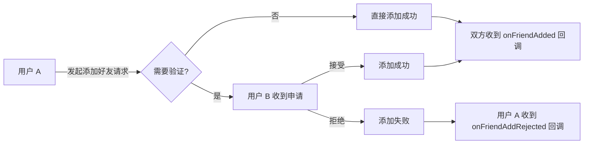

网易云信即时通讯 SDK（NetEase IM SDK，简称 NIM SDK）提供完整的好友关系管理功能，包括添加/删除好友、设置好友信息、查询好友状态和信息等操作。本文将详细介绍如何使用这些功能，以及相关的技术原理和最佳实践。

## 技术原理

NIM SDK 支持添加/删除好友，设置好友信息，查询好友状态和信息等操作。好友关系的实现主要主要涉及以下几个方面：

| 功能 | 描述
| --- | ---
| 双向好友关系 | 添加或删除好友时，双方的好友关系都会同步更新。
| 验证机制 | 支持直接添加和需要验证的两种添加好友方式。
| 实时同步 | 好友关系变更会通过回调机制实时通知应用。
| 本地缓存 | 好友列表会在本地缓存，提高查询效率。

添加好友的基本流程如下：



## 前提条件

在使用好友功能之前，请确保您已完成以下步骤:

- 已实现 [登录 IM](https://doc.yunxin.163.com/messaging2/guide/Dk1MTY4MzA?platform=client)。
- 了解 NIM SDK 中好友功能的原理。

## 注意事项

单个用户的好友数量上限与 IM 套餐相关。若需要调整好友数量上限，请自行前往 [网易云信控制台](https://app.yunxin.163.com/global/home) 进行套餐升级。

| IM 标准版 | IM 高级版 | IM 旗舰版 | IM 专属版 | 
| :---: | :---: | :---: | :---: |
| 3000 | 5000 | 8000 | 10000 |

<!--实现逻辑bug

服务端逻辑：用户B没有收到用户A的添加好友的申请，但是用户B直接调 acceptAddApplication 也能加成好友。
控制台的 *添加好友逻辑配置** 开关用来判断对方是否发起好友申请


-->

## 监听好友相关事件

在进行好友相关操作前，您可以提前注册相关事件。注册成功后，当好友相关事件发生时，SDK 会触发对应回调通知。

### 注册监听

好友相关回调：

- **`onFriendAdded`**：添加好友成功回调，返回添加成功的好友信息列表。当客户端本端直接添加好友，或者其他端同步添加好友时触发该回调。
- **`onFriendDeleted`**：删除好友回调，返回删除的好友信息。当客户端本端直接删除好友，或者其他端同步删除的好友，或者对方好友删除自己时触发该回调。
- **`onFriendAddApplication`**：申请添加好友回调，返回申请添加为好友的信息。
- **`onFriendAddRejected`**：被对方拒绝好友添加申请的回调，被拒绝的好友申请信息。
- **`onFriendInfoChanged`**：好友信息更新回调，返回变更的好友信息。当客户端本端直接更新的好友信息，或者其他端同步更新好友信息时触发该回调。

**示例代码**：

提示：若需要确认示例中使用的类/接口的方法签名、参数类型或返回结构，可使用 `nim_sdk_search_symbols` 与 `nim_sdk_list_members` 查询。

:::::: div linked-codes
::: code 安卓
调用 [`addFriendListener`](https://doc.yunxin.163.com/messaging2/client-apis/jM1MTQ0NDQ?platform=client#addFriendListener) 方法注册好友相关监听器，监听添加好友、删除好友、好友信息更新、接受或拒绝好友申请等事件。

```Java
NIMClient.getService(V2NIMFriendService.class).addFriendListener(new V2NIMFriendListener() {
    @Override
    public void onFriendAdded(V2NIMFriend friendInfo) {
    }
    @Override
    public void onFriendDeleted(String accountId, V2NIMFriendDeletionType deletionType) {
    }
    @Override
    public void onFriendAddApplication(V2NIMFriendAddApplication applicationInfo) {
    }
    @Override
    public void onFriendAddRejected(V2NIMFriendAddRejection rejectionInfo) {
    }
    @Override
    public void onFriendInfoChanged(V2NIMFriend friendInfo) {
    }
});
```
:::
::::::

### 移除监听

:::::: div linked-codes
::: code 安卓
如需移除好友相关监听器，可调用 [`removeFriendListener`](https://doc.yunxin.163.com/messaging2/client-apis/jM1MTQ0NDQ?platform=client#removeFriendListener) 方法。

```Java
NIMClient.getService(V2NIMFriendService.class).removeFriendListener(listener);
```
:::
::::::

## 添加好友

调用 `addFriend` 方法添加好友。

NIM SDK 添加好友分为以下两种模式：

- （默认）直接添加为好友，不需要对方同意。（在添加时将 `V2NIMFriendAddParams.addMode` 设置为 `V2NIM_FRIEND_MODE_TYPE_ADD`。）

    该模式下，调用接口成功后，本端和对端（被添加的好友）都会收到 `onFriendAdded` 回调。

- 请求添加对方为好友，需要对方验证通过才能添加。（在添加时将 `V2NIMFriendAddParams.addMode` 设置为 `V2NIM_FRIEND_MODE_TYPE_APPLY`。）

    该模式下，调用接口成功后，即向对方发送添加好友的申请，对端（被添加的好友）会收到 `onFriendAddApplication` 回调。对端可以选择接受或拒绝好友申请。

**示例代码**：

:::::: div linked-codes
::: code 安卓
```Java
V2NIMFriendAddParams addParams = V2NIMFriendAddParams.V2NIMFriendAddParamsBuilder.builder(addMode)
        .withPostscript("xxx")
        .build();
NIMClient.getService(V2NIMFriendService.class).addFriend("accoundId", addParams,
        new V2NIMSuccessCallback<Void>() {
            @Override
            public void onSuccess(Void unused) {
                // addMode == V2NIM_FRIEND_MODE_TYPE_ADD **添加好友成功**
                // addMode == V2NIM_FRIEND_MODE_TYPE_APPLY **添加好友请求发送成功**
            }
        },
        new V2NIMFailureCallback() {
            @Override
            public void onFailure(V2NIMError error) {

            }
        });
```
:::
::::::

## 接受好友申请

如果添加好友时，选择了 **需要对方（被添加的好友）验证通过才能成功添加为好友** 的方式。

收到添加好友申请的用户可以调用 `acceptAddApplication` 方法接受好友申请。调用接口成功后，本端和对端（发起好友申请的用户）都会收到 `onFriendAdded` 回调。

操作完成后，SDK 内部会更新申请添加好友信息（`applicationInfo`）相关操作的状态并处理相关错误码。

**示例代码**：

:::::: div linked-codes
::: code 安卓
```Java
// V2NIMFriendAddApplication application 无法构造，从查询接口获得
NIMClient.getService(V2NIMFriendService.class).acceptAddApplication(application,
        new V2NIMSuccessCallback<Void>() {
            @Override
            public void onSuccess(Void unused) {

            }
        },
        new V2NIMFailureCallback() {
            @Override
            public void onFailure(V2NIMError error) {

            }
        });
```
:::
::::::

## 拒绝好友申请

如果添加好友时，选择了 **需要对方（被添加的好友）验证通过才能成功添加为好友** 的方式。

收到添加好友申请的用户可以调用 `rejectAddApplication` 方法拒绝好友申请。调用接口成功后，对端（发起好友申请的用户）会收到 `onFriendAddRejected` 回调。

操作完成后，SDK 内部会更新申请添加好友信息（`applicationInfo`）相关操作的状态并处理相关错误码。

**示例代码**：

:::::: div linked-codes
::: code 安卓
```Java
// V2NIMFriendAddApplication application 无法构造，从查询接口获得
NIMClient.getService(V2NIMFriendService.class).rejectAddApplication(application,
        new V2NIMSuccessCallback<Void>() {
            @Override
            public void onSuccess(Void unused) {
            }
        },
        new V2NIMFailureCallback() {
            @Override
            public void onFailure(V2NIMError error) {
            }
        });
```
:::
::::::

## 删除好友

调用 `deleteFriend` 方法删除好友。调用接口成功后，本端和对端（被删除的好友）都会收到 `onFriendDeleted` 回调。

NIM SDK 当前的删除是指双向删除，即用户 A 将用户 B 从好友列表中删除时，双方的好友关系都会被解除，即用户 B 的好友列表中也删除了用户 A。

**示例代码**：

:::::: div linked-codes
::: code 安卓
```Java
V2NIMFriendDeleteParams deleteParams = V2NIMFriendDeleteParams.V2NIMFriendDeleteParamsBuilder.builder()
        .withDeleteAlias(deleteAlias)
        .build();
NIMClient.getService(V2NIMFriendService.class).deleteFriend("accoundId", deleteParams,
        new V2NIMSuccessCallback<Void>() {
            @Override
            public void onSuccess(Void unused) {
            }
        },
        new V2NIMFailureCallback() {
            @Override
            public void onFailure(V2NIMError error) {
            }
        });
```
:::
::::::

## 设置好友信息

调用 `setFriendInfo` 方法设置好友的信息，只能更新好友的备注信息（`alias`）和扩展信息（`serverExtension`）。

调用该接口成功后，本端会收到 `onFriendsInfoChanged` 回调。

**示例代码**：

:::::: div linked-codes
::: code 安卓
```Java
V2NIMFriendSetParams setParams = V2NIMFriendSetParams.V2NIMFriendSetParamsBuilder.builder()
        .withAlias(alias)
        .withServerExtension(serverExtension)
        .build();
NIMClient.getService(V2NIMFriendService.class).setFriendInfo("accountId", setParams,
        new V2NIMSuccessCallback<Void>() {
            @Override
            public void onSuccess(Void unused) {
            }
        },
        new V2NIMFailureCallback() {
            @Override
            public void onFailure(V2NIMError error) {
            }
        });
```
:::
::::::

## 查询好友列表

调用 `getFriendList` 方法本地查询好友列表。

用户登录后，SDK 开始同步好友信息，建议同步完成后，调用该接口拉取完整的好友信息列表。

**示例代码**：

:::::: div linked-codes
::: code 安卓
```Java
NIMClient.getService(V2NIMFriendService.class).getFriendList(
        new V2NIMSuccessCallback<List<V2NIMFriend>>() {
            @Override
            public void onSuccess(List<V2NIMFriend> v2NIMFriends) {
            }
        },
        new V2NIMFailureCallback() {
            @Override
            public void onFailure(V2NIMError error) {
            }
        });
```
:::
::::::

## 查询指定好友信息

调用 `getFriendByIds` 方法根据账号 ID 查询指定好友的信息列表，只返回账号 ID 存在的好友信息。

**示例代码**：

:::::: div linked-codes
::: code 安卓
```Java
NIMClient.getService(V2NIMFriendService.class).getFriendByIds(accountIds,
        new V2NIMSuccessCallback<List<V2NIMFriend>>() {
            @Override
            public void onSuccess(List<V2NIMFriend> v2NIMFriends) {
            }
        },
        new V2NIMFailureCallback() {
            @Override
            public void onFailure(V2NIMError error) {
            }
        });
```
:::
::::::

## 根据关键字搜索好友信息

调用 `searchFriendByOption` 方法根据关键字信息搜索好友的信息。

该方法默认搜索好友的备注，若有需要，也可以指定同时搜索用户账号。

**示例代码**：

:::::: div linked-codes
::: code 安卓
```Java
// 按需配置
// .withSearchAccountId()
// .withSearchAlias()
.build();
NIMClient.getService(V2NIMFriendService.class).searchFriendByOption(option,
new V2NIMSuccessCallback<List<V2NIMFriend>>() {
    @Override
    public void onSuccess(List<V2NIMFriend> v2NIMFriends) {
    }
},
new V2NIMFailureCallback() {
    @Override
    public void onFailure(V2NIMError error) {
    }
});
```
:::
::::::

## 查询好友状态

调用 `checkFriend` 方法根据账号 ID 查询好友的状态。

调用接口成功后，会返回一个 key 为 accountId，value 为好友状态的 Map。

**示例代码**：

:::::: div linked-codes
::: code 安卓
```Java
NIMClient.getService(V2NIMFriendService.class).checkFriend(accountIds, new V2NIMSuccessCallback<Map<String, Boolean>>() {
    @Override
    public void onSuccess(Map<String, Boolean> stringBooleanMap) {
    }
}, new V2NIMFailureCallback() {
    @Override
    public void onFailure(V2NIMError error) {
    }
});
```
:::
::::::

## 查询好友申请信息

调用 `getAddApplicationList` 方法查询好友申请信息列表。

NIM SDK 将按照从新到旧的顺序进行查询。

::: note note
Web/uni-app/小程序由于没有本地数据库持久化存储，申请通知只下发一次，重新登录后不再下发。
:::

**示例代码**：

:::::: div linked-codes
::: code 安卓
```Java
V2NIMFriendAddApplicationQueryOption option = V2NIMFriendAddApplicationQueryOption.V2NIMFriendAddApplicationQueryOptionBuilder.builder()
        .withLimit(limit)
        .withOffset(offset)
        .withStatus(statuses)
        .build();
NIMClient.getService(V2NIMFriendService.class).getAddApplicationList(option,
        new V2NIMSuccessCallback<V2NIMFriendAddApplicationResult>() {
            @Override
            public void onSuccess(V2NIMFriendAddApplicationResult v2NIMFriendAddApplicationResult) {
            }
        },
        new V2NIMFailureCallback() {
            @Override
            public void onFailure(V2NIMError error) {
            }
        }
);
```
:::
::::::

## 查询未读的好友申请数量

调用 `getAddApplicationUnreadCount` 方法获取未读的好友申请（状态为未处理）数量。

**示例代码**：

:::::: div linked-codes
::: code 安卓
```Java
NIMClient.getService(V2NIMFriendService.class).getAddApplicationUnreadCount(
new V2NIMSuccessCallback<Integer>() {
    @Override
    public void onSuccess(Integer count) {
        // 查询结果为 count
    }
}, new V2NIMFailureCallback() {
    @Override
    public void onFailure(V2NIMError error) {
        // 查询失败
    }
});
```
:::
::::::

## 设置好友申请已读

调用 `setAddApplicationReadEx` 方法将未读的好友申请设置为已读。

调用该方法，历史所有未读的好友申请数据将均标记为已读。

**示例代码**：

:::::: div linked-codes
::: code Android
```Java
/**
     * 标记特定好友申请为已读
     * 将指定的好友申请标记为已读状态
     */
    public void markSpecificApplicationAsRead(V2NIMFriendAddApplication application) {
        NIMClient.getService(V2NIMFriendService.class).setAddApplicationReadEx(
                application, // 传入具体的好友申请信息
                new V2NIMSuccessCallback<Void>() {
                    @Override
                    public void onSuccess(Void result) {
                        System.out.println("成功标记好友申请为已读");
                        // 更新UI，移除该申请的未读标识
                        onApplicationReadSuccess(application);
                    }
                },
                new V2NIMFailureCallback() {
                    @Override
                    public void onFailure(int code, String desc) {
                        System.err.println("标记好友申请已读失败，错误码: " + code + ", 错误描述: " + desc);
                        // 处理失败情况
                        onApplicationReadFailed(application, code, desc);
                    }
                }
        );
    }
```
:::
<!--
-->
::::::

<!--setAddApplicationRead 示例
:::::: div linked-codes
::: code 安卓
```Java
NIMClient.getService(V2NIMFriendService.class).setAddApplicationRead(
new V2NIMSuccessCallback<Void>() {
    @Override
    public void onSuccess(Void unused) {
        // 设置已读成功
    }
}, new V2NIMFailureCallback() {
    @Override
    public void onFailure(V2NIMError error) {
        // 设置已读失败
    }
});
```
:::
::::::
-->

## 清空好友申请

调用 `clearAllAddApplication` 方法清空所有好友申请。

调用该方法，历史所有的好友申请数据均被清空。

**示例代码**：

:::::: div linked-codes
::: code 安卓
```Java
NIMClient.getService(V2NIMFriendService.class).clearAllAddApplication(new V2NIMSuccessCallback<Void>() {
  @Override
  public void onSuccess(Void unused) {
   //success
  }
}, new V2NIMFailureCallback() {
  @Override
  public void onFailure(V2NIMError error) {
   //failed
  }
});
```
:::
::::::

## 删除指定的好友申请

调用 `deleteAddApplication` 方法删除指定的好友申请。

**示例代码**

:::::: div linked-codes
::: code 安卓
```Java
NIMClient.getService(V2NIMFriendService.class).deleteAddApplication(application,new V2NIMSuccessCallback<Void>() {
  @Override
  public void onSuccess(Void unused) {
   //success
  }
}, new V2NIMFailureCallback() {
  @Override
  public void onFailure(V2NIMError error) {
   //failed
  }
});
```
:::
::::::

## 相关接口

:::::: div linked-codes
::: code 安卓
API | 说明
--- | ---
[`addFriendListener`](https://doc.yunxin.163.com/messaging2/client-apis/jM1MTQ0NDQ?platform=client#addFriendListener) | 注册好友关系相关监听器
[`removeFriendListener`](https://doc.yunxin.163.com/messaging2/client-apis/jM1MTQ0NDQ?platform=client#removeFriendListener) | 取消注册好友关系相关监听器
[`addFriend`](https://doc.yunxin.163.com/messaging2/client-apis/jM1MTQ0NDQ?platform=client#addFriend) | 添加好友
[`acceptAddApplication`](https://doc.yunxin.163.com/messaging2/client-apis/jM1MTQ0NDQ?platform=client#acceptAddApplication) | 接受好友申请
[`rejectAddApplication`](https://doc.yunxin.163.com/messaging2/client-apis/jM1MTQ0NDQ?platform=client#rejectAddApplication) | 拒绝好友申请
[`deleteFriend`](https://doc.yunxin.163.com/messaging2/client-apis/jM1MTQ0NDQ?platform=client#deleteFriend) | 删除好友
[`setFriendInfo`](https://doc.yunxin.163.com/messaging2/client-apis/jM1MTQ0NDQ?platform=client#setFriendInfo) | 设置好友信息
[`getFriendList`](https://doc.yunxin.163.com/messaging2/client-apis/jM1MTQ0NDQ?platform=client#getFriendList) | 获取好友列表
[`getFriendByIds`](https://doc.yunxin.163.com/messaging2/client-apis/jM1MTQ0NDQ?platform=client#getFriendByIds) | 根据账号 ID 获取好友列表
[`searchFriendByOption`](https://doc.yunxin.163.com/messaging2/client-apis/jM1MTQ0NDQ?platform=client#searchFriendByOption) | 根据条件搜索好友
[`checkFriend`](https://doc.yunxin.163.com/messaging2/client-apis/jM1MTQ0NDQ?platform=client#checkFriend) | 根据账号 ID 查询好友关系
[`getAddApplicationList`](https://doc.yunxin.163.com/messaging2/client-apis/jM1MTQ0NDQ?platform=client#getAddApplicationList) | 获取申请添加好友信息列表
[`getAddApplicationUnreadCount`](https://doc.yunxin.163.com/messaging2/client-apis/jM1MTQ0NDQ?platform=client#getAddApplicationUnreadCount) | 获取未读的好友申请（状态为未处理）数量
[`setAddApplicationRead`](https://doc.yunxin.163.com/messaging2/client-apis/jM1MTQ0NDQ?platform=client#setAddApplicationRead) | 设置好友申请已读
[`clearAllAddApplication`](https://doc.yunxin.163.com/messaging2/client-apis/jM1MTQ0NDQ?platform=client#clearAllAddApplication) | 清空所有好友申请
[`deleteAddApplication`](https://doc.yunxin.163.com/messaging2/client-apis/jM1MTQ0NDQ?platform=client#deleteAddApplication) | 删除指定的好友申请
[`setAddApplicationReadEx`](https://doc.yunxin.163.com/messaging2/client-apis/jM1MTQ0NDQ?platform=client#setAddApplicationReadEx) |  设置好友申请已读
:::
::::::
