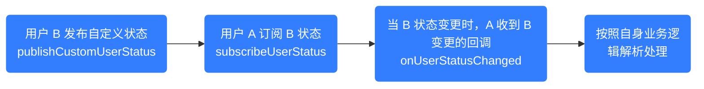

网易云信即时通讯 SDK（NetEase IM SDK，简称 NIM SDK）提供用户状态管理功能。

本文详细介绍了 NIM SDK 的用户状态管理功能。该功能支持订阅/取消订阅用户状态、发布自定义用户状态、查询用户状态订阅关系等操作，可用于实现用户在线状态显示、自定义状态展示等场景。

## 技术原理

### 用户状态类型

网易云信 NIM SDK 的用户状态分为两种类型：

- SDK 内置的用户状态。对于内置的用户状态类型，由网易云信服务器管理，客户无法直接修改。

    状态 | 值 | 描述 |
    --- | --- | --- |
    登录 | 1 | 用户已登录上线，可正常收发消息。 |
    登出 | 2 | 用户主动退出登录。 |
    断开连接 | 3 | 用户未主动退出登录，但长时间连接中断的状态。 |
    <!-- 未知，0，未知状态。-->

- 自定义的用户状态。

   客户可以自行定义和修改用户状态，如 **通话中**、**忙碌**、**听歌** 等。

### 工作流程

客户可以通过用户状态的发布和订阅，来实现 **发布-订阅** 的设计模式应用于订阅指定用户的状态、用户个性化信息订阅等场景。

网易云信 NIM SDK 内置的用户类型，无需发布，由网易云信服务器管理。具体表现为：若 A 订阅了 B 的用户状态，当 A 登录时，若 B 此时在线，则会收到 B 已登录上线的事件。若后续 B 再登录上线时，且 A 也在线，则依旧可以监听到。

如果内置的在线状态不满足业务需求，您可以按照以下流程发布自定义用户状态个性化实现业务场景。



<!--
## 效果展示

您可以使用本功能，在您的 App 中展示用户的在线状态及自定义状态，效果图如下所示：

-->

## 前提条件

若需要使用 **用户状态订阅** 功能，需要提前在 [网易云信控制台](https://app.yunxin.163.com/global/home) 开通 **在线状态订阅** 功能，具体请参考 [配置基础功能/全局功能](https://doc.yunxin.163.com/messaging2/guide/jU0Mzg0MTU?platform=client#全局功能)。

## 注意事项

- 用户状态订阅是单向的，双方需各自订阅对方状态。
- 在线状态事件会受到推送的影响。

    - 如果应用被清理（退出应用等），但可以接收第三方厂商推送（APNS、小米、华为、OPPO、VIVO、魅族、FCM）消息，则默认不会触发该用户断开连接的事件（即此情况仍视为 **在线** 状态）。若您需要将该情况视为离线，请前往 [网易云信控制台](https://app.yunxin.163.com/global/home) 将在线状态订阅配置项下修改推送状态。

        
        
    - 如果没有集成推送，或者推送不可达时，当用户断开连接时，会触发断开连接事件。

- 当订阅者登录时，若被订阅者在线，那么会收到其在线的事件回调。但若对方离线，那么订阅者无法收到其离线的事件回调（只有后续对方重新登录，才能触发在线状态事件）。因此建议登录时将所有账号的在线状态设置为离线，这样设置，登录时无论对方是在线，还是从离线变更为在线，都能正常触发回调。

## 监听用户状态订阅相关事件

在进行用户状态订阅相关操作前，您可以提前注册相关事件。注册成功后，当相关事件发生时，SDK 会触发对应回调通知。

### 注册监听

用户状态订阅相关回调：

`onUserStatusChanged`：已订阅用户的用户状态变更回调，包括在线状态和自定义状态。同账号发布状态时，多端也会同步收到回调。

**示例代码**：

提示：若需要确认示例中使用的类/接口的方法签名、参数类型或返回结构，可使用 `nim_sdk_search_symbols` 与 `nim_sdk_list_members` 查询。

:::::: div linked-codes
::: code 安卓
调用 [`addSubscribeListener`](https://doc.yunxin.163.com/messaging2/client-apis/zY2MzAxNjQ?platform=client#addSubscribeListener) 方法注册用户状态订阅相关监听器，监听用户状态变更事件。

```Java
V2NIMSubscribeListener listener = new V2NIMSubscribeListener() {
  @Override
  public void onUserStatusChanged(List<V2NIMUserStatus> userStatusList) {
   //用户状态变更
  }
};
NIMClient.getService(V2NIMSubscriptionService.class).addSubscribeListener(listener);
```
:::
::::::

### 移除监听

:::::: div linked-codes
::: code 安卓
如需移除用户相关监听器，可调用 [`removeSubscribeListener`](https://doc.yunxin.163.com/messaging2/client-apis/zY2MzAxNjQ?platform=client#removeSubscribeListener) 方法。
```Java
NIMClient.getService(V2NIMSubscriptionService.class).removeSubscribeListener(listener);
```
:::
::::::

## 订阅用户状态

调用 `subscribeUserStatus` 方法订阅指定用户的状态。

成功订阅用户状态后，当订阅的用户状态有变更时，会触发 `onUserStatusChanged` 回调，收到指定用户的状态变更通知。

::: note note
- 单次最多订阅 100 个用户的状态，可多次调用该接口，订阅更多的用户状态，但是总订阅人数最多为 3000，若超限，则默认删除最老的订阅，即有效订阅最多为 3000 个。
- 订阅有效期为 60 - 2592000 秒（即 60 秒至 30 天）。过期后需要重新订阅。如果未过期的情况下重复订阅，新设置的有效期会覆盖之前的有效期。
- 若同一账号多端重复订阅，订阅有效期默认会覆盖（新的覆盖前一次时长）。但如果在订阅后 30s 内重复订阅，该操作会被直接丢弃。因此建议 30s 后再进行操作。在 30s 后重复订阅，新设置的有效期才会覆盖之前的有效期。
- 若传入的账号 ID 都不存在，则调用接口失败。若部分账号 ID 存在，则调用接口成功。调用结果只返回账号 ID 存在的用户状态，错误的账号 ID 不返回。
:::

**示例代码**：

:::::: div linked-codes
::: code 安卓
```Java
List<String> accountIds = Arrays.asList("account1", "account2");
//订阅的有效期，时间范围为 60~2592000，单位：秒
long duration = 60L;
//订阅后是否立即同步事件状态值，默认为 false。为 true：表示立即同步当前状态值 但为了性能考虑，30S 内重复订阅，会忽略该参数
boolean immediateSync = false;
V2NIMSubscribeUserStatusOption option = new V2NIMSubscribeUserStatusOption(accountIds, duration, immediateSync);
NIMClient.getService(V2NIMSubscriptionService.class).subscribeUserStatus(option, new V2NIMSuccessCallback<List<String>>() {
  @Override
  public void onSuccess(List<String> failList) {
   //订阅成功,返回订阅失败的 failList
  }
}, new V2NIMFailureCallback() {
  @Override
  public void onFailure(V2NIMError error) {
   //订阅失败
  }
});
```
:::
::::::

## 取消订阅用户状态

调用 `unsubscribeUserStatus` 方法取消用户状态的订阅。

订阅有效期为 60 - 2592000 秒（即 60 秒至 30 天）。过期后，订阅关系将自动解除。

**示例代码**：

:::::: div linked-codes
::: code 安卓
```Java
List<String> accountIds = Arrays.asList("account1", "account2");
V2NIMUnsubscribeUserStatusOption option = new V2NIMUnsubscribeUserStatusOption(accountIds);
NIMClient.getService(V2NIMSubscriptionService.class).unsubscribeUserStatus(option, new V2NIMSuccessCallback<List<String>>() {
  @Override
  public void onSuccess(List<String> failList) {
   //取消订阅成功,返回取消订阅失败的 failList
  }
}, new V2NIMFailureCallback() {
  @Override
  public void onFailure(V2NIMError error) {
   //取消订阅失败
  }
});
```
:::
::::::

## 查询用户状态订阅关系

调用 `queryUserStatusSubscriptions` 方法查询用户状态订阅关系。

传入账号列表，查询自己订阅了其中哪些账号的状态，调用接口成功后，返回订阅的账号列表，以及订阅有效期。

**示例代码**：

:::::: div linked-codes
::: code 安卓
```Java
List<String> accountIds = Arrays.asList("account1", "account2");
NIMClient.getService(V2NIMSubscriptionService.class).queryUserStatusSubscriptions(accountIds, new V2NIMSuccessCallback<List<V2NIMUserStatusSubscribeResult>>() {
  @Override
  public void onSuccess(List<V2NIMUserStatusSubscribeResult> v2NIMUserStatusSubscribeResults) {
   //查询成功
  }
}, new V2NIMFailureCallback() {
  @Override
  public void onFailure(V2NIMError error) {
   //查询失败
  }
});
```
:::
::::::

## 发布用户自定义状态

如果默认在线状态不满足业务需求，可以调用 `publishCustomUserStatus` 方法发布用户自己的自定义状态。

**示例代码**：

:::::: div linked-codes
::: code 安卓
```Java
//自定义设置值：10000 以上，包括一万，一万以内为预定义值
int statusType = 10001;
//状态的有效期，单位秒，范围为 60s 到 7days
long duration = 60L;
//用户发布状态时设置的扩展字段
String extension = "{\"key\":\"value\"}";
//用户发布状态时是否只广播给在线的订阅者，默认值为 TRUE
boolean onlineOnly = true;
// 用户发布状态时是否需要多端同步，默认值为 FALSE
boolean multiSync = false;
//自定义用户状态参数
V2NIMCustomUserStatusParams params = new V2NIMCustomUserStatusParams.Builder(statusType,duration)
   .extension(extension)
   .onlineOnly(onlineOnly)
   .multiSync(multiSync)
   .build();
NIMClient.getService(V2NIMSubscriptionService.class).publishCustomUserStatus(params, new V2NIMSuccessCallback<V2NIMCustomUserStatusPublishResult>() {
  @Override
  public void onSuccess(V2NIMCustomUserStatusPublishResult v2NIMCustomUserStatusPublishResult) {
   //发布自定义用户状态成功
  }
}, new V2NIMFailureCallback() {
  @Override
  public void onFailure(V2NIMError error) {
   //发布自定义用户状态失败
  }
});
```
:::
::::::

## 相关接口

通过使用以下 API，开发者可以为用户提供有效的用户状态订阅功能，提升应用的用户体验。在实际开发中，请结合具体需求和场景，合理使用用户状态订阅管理功能。

:::::: div custom-tabs
::: tab 安卓
API | 说明
--- | ---
[`addSubscribeListener`](https://doc.yunxin.163.com/messaging2/client-apis/zY2MzAxNjQ?platform=client#addSubscribeListener) | 注册用户状态订阅相关监听器
[`removeSubscribeListener`](https://doc.yunxin.163.com/messaging2/client-apis/zY2MzAxNjQ?platform=client#removeSubscribeListener) | 取消注册用户状态订阅相关监听器
[`subscribeUserStatus`](https://doc.yunxin.163.com/messaging2/client-apis/zY2MzAxNjQ?platform=client#subscribeUserStatus) | 订阅用户状态
[`unsubscribeUserStatus`](https://doc.yunxin.163.com/messaging2/client-apis/zY2MzAxNjQ?platform=client#unsubscribeUserStatus) | 取消订阅用户状态
[`queryUserStatusSubscriptions`](https://doc.yunxin.163.com/messaging2/client-apis/zY2MzAxNjQ?platform=client#queryUserStatusSubscriptions) | 查询用户状态订阅关系
[`publishCustomUserStatus`](https://doc.yunxin.163.com/messaging2/client-apis/zY2MzAxNjQ?platform=client#publishCustomUserStatus) | 发布用户自定义状态
:::
::::::

## 常见问题

Q: 为什么我订阅了用户状态，但没有收到回调？

A: 请检查是否正确注册了用户状态变更监听器，以及订阅操作是否成功。另外，如果被订阅用户的状态没有变化，也不会触发回调。

Q: 自定义状态的 `statusType` 应该如何设置？

A: `statusType` 应大于 10000，建议根据不同的业务场景选择不同的值，便于管理和识别。

Q: 如何处理订阅人数超过限制的情况？

A: 当订阅人数接近 3000 时，可以考虑取消一些不活跃用户的订阅，或者根据业务重要性进行优先级管理。

Q: 多端登录时，用户状态如何同步？

A: 使用 `multiSync` 参数可以实现多端同步。当设置为 true 时，同一账号的其他在线设备也会收到状态变更通知。

Q: 如何优化频繁的状态查询？

A: 可以在本地缓存用户状态，并设置合理的缓存过期时间。同时，利用状态变更回调及时更新本地缓存，减少不必要的查询操作。
