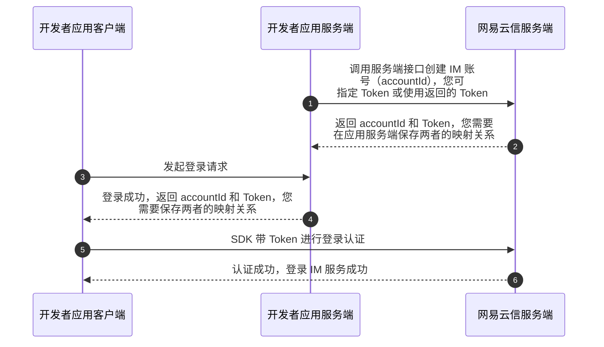

<!-- keywords: 即时通讯,IM,登录, 登录流程, 账号集成,账号集成与登录, 登录状态, 登出, 注销登录, 登出 IM -->

初始化网易云信即时通讯 SDK（NetEase IM SDK，简称 NIM SDK）之后，您可以调用接口登录 IM 应用。账号登录成功后，应用才能正常调用收发消息和创建会话等其他 SDK 接口。本文介绍账号集成与登录的技术原理、实现 IM 登录及登出的流程、IM 登录状态转换流程，以及相关常见问题。

## 登录策略

根据鉴权方式，登录策略分为三种：静态 Token 登录、动态 Token 登录和通过第三方回调登录。您可按需实现 **一种或多种** 登录策略。更多相关说明，请参考 [IM 登录最佳实践](https://doc.yunxin.163.com/messaging2/guide/TAwMDkyNTc?platform=client) 和 [登录鉴权](https://doc.yunxin.163.com/messaging2/server-apis/jA1MTQ4MDU?platform=server)。

## 登录流程

<!--  -->

IM 的登录与账号集成密切相关，有关如何设计登录流程，请参考下文 [如何根据产品形态设计 IM 登录流程](#choice)。下图展示了应用集成 NIM SDK 后，从账号注册、账号集成、登录 IM 成功的主要流程：



<!--
1. 用户在应用客户端注册用户账号时，由应用服务端向网易云信服务端发起 [注册 IM 账号](https://doc.yunxin.163.com/messaging2/server-apis/TQyNjgyMzc?platform=server) 的请求。
2. IM 账号创建成功后，网易云信服务端会返回该 IM 账号（即 `accountId`）和 `token` 等信息。此时，应用服务端需要负责保存 `accountId` 和 `token` 的映射关系。
3. 应用客户端发起登录请求时，先走应用自有的登录验证逻辑，如账号和密码的验证。
4. 验证成功后，应用服务端将与该用户对应的 `accountId` 和 `token` 等信息返回给应用客户端。此时，应用客户端需要负责保存 `accountId` 和 `token` 的映射关系。
5. 当应用客户端需要调用网易云信的 IM 服务时，需要先进行 `token` 验证，以登录 IM 服务。
6. `token` 验证成功后，应用客户端登录 IM 服务成功。之后用户便可调用 NIM SDK 的相关接口使用 IM 服务，如进行 IM 消息收发。-->

::: note note
- 终端用户使用网易云信 IM 服务时，应用本身的用户账号和网易云信的 IM 账号（`accountId`） **彼此独立**。网易云信的 IM 账号只用于网易云信 IM 服务的鉴权，**IM 账号并不等同于应用的用户账号**。
- 应用的用户账号和密码，与网易云信登录 IM 使用的 `accountId` 和 `token` 完全不一致。`accountId` 和 `token` 不由终端用户创建，而是由应用服务端分配，以保证安全性。
:::

## 前提条件

根据本文操作前，请确保您已经完成了以下操作：

- 初始化 SDK。
- （可选）在 [网易云信控制台](https://app.yunxin.163.com/global/home) 上 [配置客户端应用标识](https://doc.yunxin.163.com/console/docs/jU3MDY4Njk?platform=console#配置客户端应用标识)。

## 第一步：配置登录策略

登录策略指您的应用需要采用的一种或多种 IM 登录方式。登录 IM 前，您需要在 [网易云信控制台](https://app.yunxin.163.com/global/home) 配置应用的 IM 登录策略。如未配置相应的登录策略，后续调用登录接口时可能因无登录权限而报错（状态码：403）。

1. 在 [网易云信控制台](https://app.yunxin.163.com/global/home) 首页 **应用管理** 中选择应用，然后单击 **IM 即时通讯** 下的 **功能配置** 按钮进入功能配置页。

    

2. 在顶部选择 **基础功能** 页签，配置 **登录策略**。

    

## 第二步：准备 Token

根据以上配置的 **登录策略**，您需要获取对应的 Token 以供后续鉴权。

- **静态 Token**：默认永久有效。如有需要，可通过网易云信新版服务端 API [主动刷新 Token](https://doc.yunxin.163.com/messaging2/server-apis/DUwODIwMTg?platform=server)。

- **动态 Token**：具有时效性，可在生成时设置有效期。

- **动态登录扩展数据**（`LoginExtension`）：适用于所有登录模式。如果在 **第三方回调登录** 模式中设置动态登录扩展数据，第三方服务器可使用该值来进行鉴权。

<a id="queryStaticToken"></a>

### 场景一：**获取静态 Token**

您可以通过以下两种方式获取静态 Token，用于 [静态 Token 登录](#staticToken) 的鉴权。

- **方式一**：在 [网易云信控制台](https://app.yunxin.163.com/global/home) 获取静态 Token。

    如果您只需进行简单的 **体验或快速测试**，那么可以在 [网易云信控制台](https://app.yunxin.163.com/global/home) 创建 IM 测试账号，并获取与该账号对应的静态 Token，获取方式请参考 [注册 IM 账号](https://doc.yunxin.163.com/messaging2/quick-start/jU0Mzg0MTU?platform=client#4-注册-im-账号)。

- **方式二**：调用服务端 API 获取静态 Token。

    如果您有正式的 **生产环境**，且您的业务 **需保障基础的用户信息安全**，那么可通过网易云信 IM 新版服务端 API [注册 IM 正式账号](https://doc.yunxin.163.com/messaging2/server-apis/TQyNjgyMzc?platform=server)，并获取与之相对应的静态 Token。

<a id="queryRandomToken"></a>

### 场景二：**获取动态 Token**

如果您有正式的 **生产环境**，且您的业务 **对用户信息安全有较高的要求**，可选择 [动态 Token 登录](#randomToken)。获取动态 Token 步骤如下：

1. 注册 IM 账号，获取 `accountId`。

    - **方式一**：在 [网易云信控制台](https://app.yunxin.163.com/global/home) 注册 IM 测试账号。

        如果您只需进行简单的 **体验或快速测试**，那么可以在 [网易云信控制台](https://app.yunxin.163.com/global/home) 创建 IM 测试账号，请参考 [注册 IM 账号](https://doc.yunxin.163.com/messaging2/quick-start/jU0Mzg0MTU?platform=client#4-注册-im-账号)。

    - **方式二**：调用服务端 API 注册 IM 正式账号。

        如果您有正式的 **生产环境**，且您的业务 **需保障基础的用户信息安全**，那么可通过网易云信 IM 新版服务端 API [注册 IM 正式账号](https://doc.yunxin.163.com/messaging2/guide/TQyNjgyMzc?platform=server)。

2. 基于 App Key、App Secret 和 `accountId`，通过 [约定算法](https://doc.yunxin.163.com/messaging2/server-apis/jA1MTQ4MDU?platform=server#动态-token-鉴权) 在 **应用服务端** 生成动态 Token。

3. 客户端可在登录时通过 `tokenProvider`，从回调中获取动态 Token。具体实现方式请参考下文 [动态 Token 登录](#randomToken)。

### 场景三：**获取动态登录扩展数据**

客户端可在登录时通过 `loginExtensionProvider`，从回调中获取动态登录扩展数据。具体实现方式请参考下文 [通过第三方回调登录](#callbackAsToken)。

## 第三步：注册事件监听

### **注册登录状态变化监听**

调用注册登录状态变化监听接口监听以下回调：

- **`onLoginStatus`**：登录状态变化回调
- **`onLoginFailed`**：登录失败回调
- **`onKickedOffline`**：登录终端被其他端踢下线回调
- **`onLoginClientChanged`**：登录终端登录信息变更回调

:::::: div linked-codes
::: code Flutter

- **添加监听**：[`listen`](https://doc.yunxin.163.com/messaging2/client-apis/Dc3NDM0NTI?platform=client#listen)


    ```Dart
    final subsriptions = <StreamSubscription>[];
    subsriptions.add(NimCore.instance.loginService.onLoginStatus.listen((event) {
    }));
    subsriptions.add(NimCore.instance.loginService.onLoginFailed.listen((event) {
    }));
    subsriptions.add(NimCore.instance.loginService.onKickedOffline.listen((event) {
    }));
    subsriptions.add(NimCore.instance.loginService.onLoginClientChanged.listen((event) {
    }));
    ```

- **移除监听**：[`cancel`](https://doc.yunxin.163.com/messaging2/client-apis/Dc3NDM0NTI?platform=client#cancel)

    ```Dart
    subsriptions.forEach((subsription) {
    subsription.cancel();
    });
    ```
:::
::::::

### **注册登录连接状态监听**

登录 IM 时，客户端会与 IM 服务端建立长连接，连接成功则登录成功。

登录 IM 成功后，SDK 会自动同步离线消息、漫游消息、用户信息、群信息、系统通知等数据。**数据同步完成时，整个登录过程才算真正完成**。

调用注注册登录连接状态监听接口监听以下回调：

- **`onConnectStatus`**：登录连接状态变化回调。
- **`onDisconnected`**：登录连接断开回调。
- **`onConnectFailed`**：登录连接失败回调。
- **`onDataSync`**：数据同步状态变化回调。发送消息等后续操作要求数据库处于开启状态，否则可能导致发送消息失败，或者阻塞等待数据库开启。

:::::: div linked-codes
::: code Flutter
- **添加监听**：[`listen`](https://doc.yunxin.163.com/messaging2/client-apis/Dc3NDM0NTI?platform=client#listen)


    ```Dart
    final subsriptions = <StreamSubscription>[];
    subsriptions.add(NimCore.instance.loginService.onConnectStatus.listen((event) {
    }));
    subsriptions.add(NimCore.instance.loginService.onDisconnected.listen((event) {
    }));
    subsriptions.add(NimCore.instance.loginService.onConnectFailed.listen((event) {
    }));
    subsriptions.add(NimCore.instance.loginService.onDataSync.listen((event) {
    }));
    ```

- **移除监听**：[`cancel`](https://doc.yunxin.163.com/messaging2/client-apis/Dc3NDM0NTI?platform=client#cancel)

    ```Dart
    subsriptions.forEach((subsription) {
      subsription.cancel();
    });
    ```

:::
::::::

## 第四步：登录 IM 应用

<a id="staticToken"></a>

### 场景一：**静态 Token 登录**

调用 `login` 方法登录 IM，鉴权方式为静态 Token 鉴权。

调用后，SDK 会自动连接 IM 服务端，传递用户信息并返回登录结果。登录过程中用户可主动取消登录。如果因为网络或其他原因导致 IM 服务端长时间未响应，用户未主动取消登录，SDK 将在 45 秒后自动重连 IM 服务端，并返回 [错误码](https://doc.yunxin.163.com/messaging2/client-apis/DUxNjU3MzU?platform=client)。

**登录部分参数说明**：

参数名称 | 说明
--- | ---
`accountId` | IM 为用户分配的唯一登录账号。通过网易云信控制台获取或调用新版服务端 API 注册。获取方式请参考 [获取静态 Token](#queryStaticToken)。
`token` | 静态鉴权 Token，通过网易云信控制台获取或调用服务端 API 生成。获取方式请参考 [获取静态 Token](#queryStaticToken)。
`option` | 登录配置。静态 Token 登录可配置如下字段：<ul><li>`forceMode`：是否强制登录</li><li>`timeout`：登录超时时间</li><li>`retryCount`：登录失败后重试次数</li><li>`authType`：鉴权方式，默认为 0 静态 Token 鉴权</li><li>`syncLevel`：数据同步模式，分为完全同步和基础数据同步

**示例代码**：

:::::: div linked-codes
::: code Flutter
```Dart
final loginResult = await NimCore.instance.loginService.login(
    "ACCOUNT_ID", "TOKEN", NIMLoginOption());
```
:::
::::::

<a id="randomToken"></a>

### 场景二：**动态 Token 登录**

调用 `login` 方法登录 IM，鉴权方式为动态 Token 鉴权。您需要将 `authType` 设置为 1，并设置获取动态 Token 回调 `tokenProvider`。

调用完成后，NIM SDK 会自动连接网易云信服务端，传递用户信息，返回登录结果。登录过程中可主动取消登录。如果因为网络或其他原因导致网易云信服务端长时间未响应，用户也没有主动取消登录，NIM SDK 将在 45 秒后自动重新连接网易云信服务端，并返回错误码，错误码详情参考 [错误码](https://doc.yunxin.163.com/messaging2/client-apis/DUxNjU3MzU?platform=client#连接错误) 连接错误章节。

**登录部分参数说明**：

参数名称 | 说明
--- | ---
`accountId` | IM 为用户分配的唯一登录账号。通过网易云信控制台获取或调用服务端 API 注册。获取方式请参考 [获取动态 Token](#queryRandomToken)。
`token` | 静态鉴权 Token，可不填。<br>如果您的应用启用了聊天室功能，并且采用非独立模式&静态 Token 登录策略，那么该参数必须设置，后续非独立模式的聊天室静态登录时会使用该静态 Token。
`option` | 登录配置。动态 Token 登录可配置如下字段：<ul><li>`forceMode`：是否强制登录</li><li>`timeout`：登录超时时间</li><li>`retryCount`：登录失败后重试次数</li><li>`authType`：鉴权方式，必须设置为 1</li><li>`syncLevel`：数据同步模式，分为完全同步和基础数据同步</li><li>`tokenProvider`：获取动态 Token 回调，如果使用动态 Token 鉴权方式该字段必填。动态 Token 基于 App Key、App Secret 和 `accountId`，通过约定算法在服务端生成。该回调在登录连接完成、登录鉴权校验前触发。若函数执行有异常或返回非预期内容（非法字符串），则登录中止并报错。

:::note notice
- 如果设置了获取动态 Token 回调，但返回空值且未传入静态 Token，则返回 414 错误码，网易云信 IM 不做登录请求。
- 若设置了获取动态 Token 回调且返回空值，但是已传入静态 Token，也会返回相关错误码。但 SDK 会持续与服务端进行重连，直到获取到动态 Token（不计入自动重连次数）。
:::

**示例代码**：

:::::: div linked-codes
::: code Flutter
```Dart
var options = NIMLoginOption();

options.authType = NIMLoginAuthType.authTypeDynamicToken;

NimCore.instance.loginService.tokenProvider =
    (String accountId) async {
    return "return your token with accountId";
};

final loginResult = await NimCore.instance.loginService.login(
    accountEditingController.text, passwordEditingController.text, options);
```
:::
::::::

<a id="callbackAsToken"></a>

### 场景三：**第三方回调登录**

如采用该登录策略，**网易云信 IM 不做登录鉴权**，鉴权工作需由指定的第三方服务器（可以是应用服务器）进行。

1. 通过第三方回调登录 IM，首先需要 [开通和配置第三方服务](https://doc.yunxin.163.com/messaging/server-apis/jI3ODc2ODE?platform=server#开通和配置第三方服务)。

2. 如果您需要采用第三方服务器的动态登录扩展数据或动态 Token 进行鉴权，那么需要在调用 `login` 方法登录时将 `authType` 设置为 2，并设置获取动态登录扩展数据 `loginExtensionProvider` 回调和获取动态 Token 回调 `tokenProvider`，SDK 会在登录过程中获取第三方回调的动态扩展数据和动态 Token。

    调用完成后，NIM SDK 会自动连接网易云信服务端，传递用户信息，返回登录结果。登录过程中可主动取消登录。如果因为网络或其他原因导致网易云信服务端长时间未响应，用户也没有主动取消登录，NIM SDK 将在 45 秒后自动重新连接网易云信服务端，并返回 [错误码](https://doc.yunxin.163.com/messaging2/client-apis/DUxNjU3MzU?platform=client)。

    **登录部分参数说明**：

    参数名称 | 说明
    --- | ---
    `accountId` | IM 为用户分配的唯一登录账号。通过网易云信控制台获取或调用服务端 API 注册。
    `token` | 静态鉴权 Token，可不填。<br>如果您的应用启用了聊天室功能，并且采用非独立模式&静态 Token 登录策略，那么该参数必须设置，后续非独立模式的聊天室静态登录时会使用该静态 Token。
    `option` | 登录配置。动态 Token 登录可配置如下字段：<ul><li>`forceMode`：是否强制登录</li><li>`timeout`：登录超时时间</li><li>`retryCount`：登录失败后重试次数</li><li>`authType`：鉴权方式，必须设置为 2</li><li>`syncLevel`：数据同步模式，分为完全同步和基础数据同步</li><li>`loginExtensionProvider`：获取用户登录业务扩展数据回调，如果使用第三方回调鉴权方式，该字段必填。该回调在登录连接完成、登录鉴权校验前触发。若函数执行有异常或返回非预期内容（非法字符串），则登录中止并报错</li><li>`tokenProvider`：获取动态 Token 回调，如果使用第三方回调鉴权方式，该字段用于第三方服务器的动态 Token 鉴权

    :::note notice
    - 如果设置了获取动态登录扩展数据回调和获取动态 Token 回调，但都返回空值且未传入静态 Token，则返回 414 错误码，网易云信 IM 不做登录请求。
    - 若设置了获取动态登录扩展数据回调和获取动态 Token 回调且返回空值，但是已传入静态 Token，也会返回相关错误码。但 SDK 会持续与服务端进行重连，直到获取到动态登录扩展数据或动态 Token（不计入自动重连次数）。
    :::

    **示例代码**：

    以通过 **第三方动态登录扩展数据** `loginExtensionProvider` 回调登录为例：

    :::::: div linked-codes
    ::: code Flutter
    ```Dart
    var options = NIMLoginOption();

    options.authType = NIMLoginAuthType.authTypeThirdParty;

    NimCore.instance.loginService.loginExtensionProvider =
        (String accountId) async {
      return "return your login extension with accountId";
    };

    final loginResult = await NimCore.instance.loginService.login(
        accountEditingController.text, passwordEditingController.text, options);
    ```
    :::
    ::::::

    :::note notice
    - 通过第三方回调登录，如果设置了获取第三方动态 Token 和登录扩展数据回调，但都返回空值且未传入静态 Token 和登录扩展数据（可能第三方服务器设置了动态时间），则直接返回 414 错误码，网易云信 IM 内部不做登录请求。
    - 若设置了获取第三方动态 Token 和登录扩展数据回调且返回空值，但是已传入静态 Token，也会返回相关错误码，但会持续与服务端进行重连，直到动态 Token 传入（不计入自动重连次数）。
    :::

3. 在服务端发起 [登录相关回调](https://doc.yunxin.163.com/messaging/server-apis/jc3MzA5NTk?platform=server) 请求，由第三方服务器进行鉴权并判定 IM 登录事件是否放行通过。

    若不通过，网易云信服务端将返回 302 错误码。

## 第五步：查询登录状态

本步骤为可选步骤，您可以通过 `getLoginStatus` 方法主动查询当前账号是否处于登录状态。

返回当前用户的登录的状态枚举值说明，请参考 IM 登录最佳实践的 [获取登录状态](https://doc.yunxin.163.com/messaging2/guide/TAwMDkyNTc?platform=client#获取登录状态)。

:::::: div linked-codes
::: code Flutter
```Dart
final loginStatus = await NimCore.instance.loginService.getLoginStatus();
```
:::
::::::

## 第六步：了解其他操作

### 登出账号

一般情况下，如果您的应用生命周期跟 NIM SDK 生命周期一致，用户在退出应用前可以不登出，直接退出即可。

但某些特殊场景，例如用户仅在进入特定界面后才调用 NIM SDK 的能力，退出界面后不再调用，此时需要调用 NIM SDK 的登出接口注销 IM 登录。登出后，用户将不再接收 IM 的消息。

用户在登出应用/注销自己的账号时需要调用 `logout` 方法登出 IM，该方法没有回调。

**示例代码**：

:::::: div linked-codes
::: code Flutter
```Dart
final logoutResult = await NimCore.instance.loginService.logout();
```
:::
::::::

:::note notice
请勿频繁调用登录、登出方法，其间隔至少要大于 3 秒。
:::

### 断线重连

SDK 提供了自动重连机制，当网络问题导致连接断开或超时，SDK 会自动重新建立与网易云信服务端的连接并重新登录，您 **无需主动重复登录**。您可以调用 `addLoginDetailListener` 方法注册登录连接状态监听器，通过 `onConnectStatus` 回调监听重连后的登录状态变更。

### 查询登录信息

您可以调用 `getLoginClients` 和 `getCurrentLoginClient` 方法查询多端登录的列表信息和当前登录终端的信息，包括终端类型、IP、登录时间等。

### 登录最佳实践

登录对于 IM 产品来说至关重要，是后续业务顺利进行的前提条件。您可以参考 [IM 登录最佳实践](https://doc.yunxin.163.com/messaging2/guide/TAwMDkyNTc?platform=client) 实现正确使用登录接口或处理登录状态。

### 多端登录互踢

网易云信即时通讯 IM 支持多客户端同时登录，同时支持设置客户端之间的互斥关系。您可以通过 自动 和 手动 两种方式实现应用在不同客户端间的登录制约，让账号在多余的客户端强制下线，避免重复登录，简称 多端登录互踢。详情请参考 [多端登录互踢](https://doc.yunxin.163.com/messaging2/guide/DUyNjI2MjQ?platform=client)。

## 相关接口

:::::: div linked-codes
::: code Flutter
API | 说明
--- | ---
[`listen`](https://doc.yunxin.163.com/messaging2/client-apis/Dc3NDM0NTI?platform=client#listen) | 注册登录相关监听器
[`cancel`](https://doc.yunxin.163.com/messaging2/client-apis/Dc3NDM0NTI?platform=client#cancel) | 取消注册登录相关监听器
[`login`](https://doc.yunxin.163.com/messaging2/client-apis/Dc3NDM0NTI?platform=client#login) | 登录 IM
[`logout`](https://doc.yunxin.163.com/messaging2/client-apis/Dc3NDM0NTI?platform=client#logout) | 登出 IM
[`getLoginStatus`](https://doc.yunxin.163.com/messaging2/client-apis/Dc3NDM0NTI?platform=client#getLoginStatus) | 获取当前登录状态
[`tokenProvider`](https://doc.yunxin.163.com/messaging2/client-apis/Dc3NDM0NTI?platform=client#tokenProvider) | 获取动态登录 token
[`loginExtensionProvider`](https://doc.yunxin.163.com/messaging2/client-apis/Dc3NDM0NTI?platform=client#loginExtensionProvider) | 获取登录扩展信息 loginExtension
[`getLoginClients`](https://doc.yunxin.163.com/messaging2/client-apis/Dc3NDM0NTI?platform=client#getLoginClients) | 获取多端登录列表信息
[`getCurrentLoginClient`](https://doc.yunxin.163.com/messaging2/client-apis/Dc3NDM0NTI?platform=client#getCurrentLoginClient) | 获取当前登录终端的信息
:::
::::::

## 常见问题

<a id="choice"></a>

### 如何根据产品形态设计 IM 登录流程？

接入网易云信 IM 服务的产品大致分为两种形态：

- **IM 产品**：通讯是其核心模块。典型示例如微信、易信、网络直播相关应用。

    对于 IM 产品，通讯能力是核心能力。如果网易云信无法登录成功，则整个应用将无法正常表现。所以推荐您在执行业务逻辑前，首先完成应用服务端和网易云信服务端的登录。只有应用服务端和网易云信服务端都登录成功，才认为整个登录完成。

- **非 IM 产品**：通讯是其附带模块。典型示例如各种有私信模块的应用。


    对于非 IM 产品，通讯能力是可以在登录应用服务端成功后延迟加载，登录成功拿到服务端下发的网易云信 IM 账号和 `token` 后进行自动登录即可。

### 如何处理登录请求被拒绝问题？

若您开启了应用标识安全验证，需要在将列表中写入允许的客户端应用标识。当请求登录的客户端应用标识不在列表中时，登录请求将被拒绝。

在 [网易云信控制台](https://app.yunxin.163.com/global/home) 首页 **应用管理** 选择应用进入 **应用配置** 页面，顶部选择 **标识管理** 页签，添加对应的客户端应用标识。

