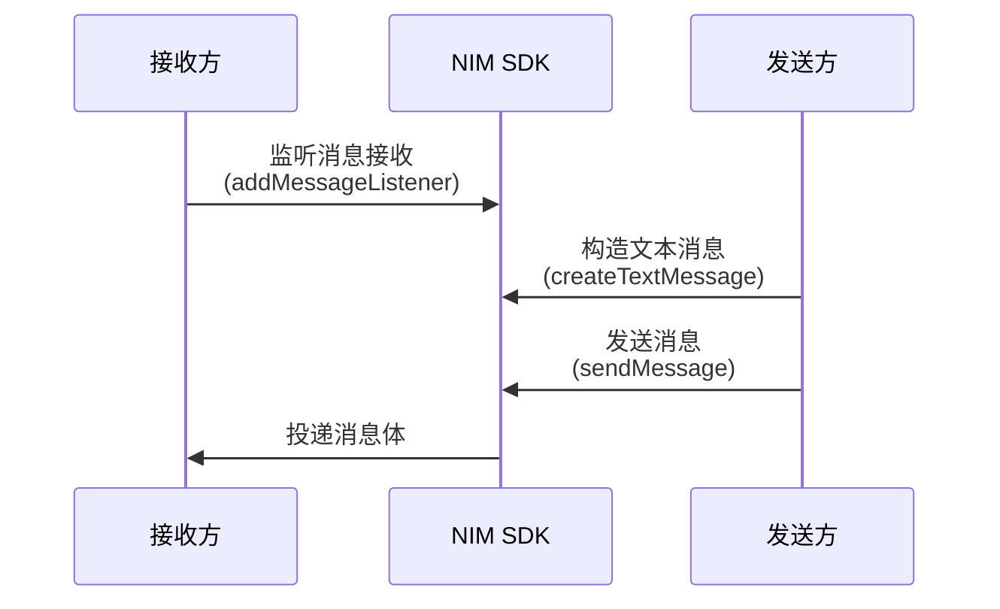
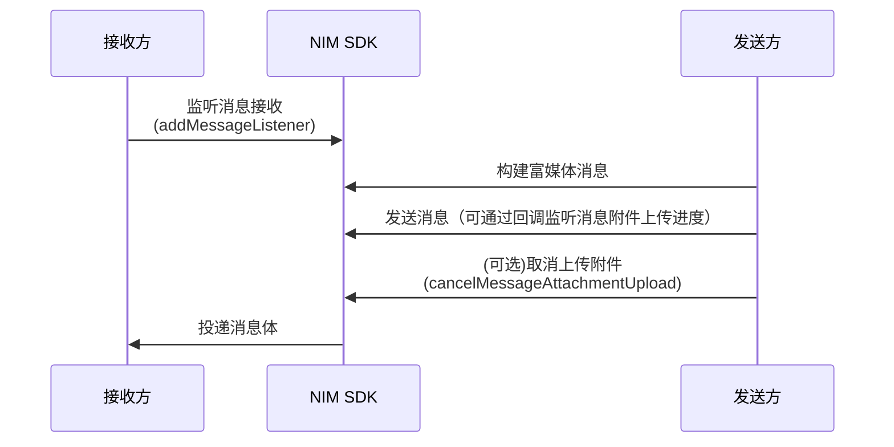
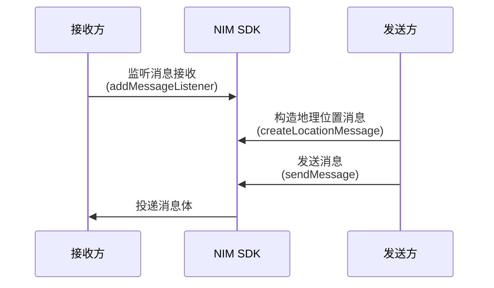

<!--keywords: 消息收发, 消息, 发送消息, 接收消息, 文本消息，图片消息，音频消息，视频消息，富媒体消息，广播消息，提示消息，自定义消息 -->

本文介绍通过网易云信即时通讯 SDK（NetEase IM SDK，简称 NIM SDK）实现消息收发的具体流程，帮助您快速实现多样化的消息交互场景。本文介绍的消息收发仅包含单聊、高级群、超大群消息，不包含聊天室、圈组的消息，具体实现流程请分别参考 [聊天室消息收发](https://doc.yunxin.163.com/messaging2/guide/DQzNjE0MDU?platform=client#聊天室消息收发) 和 [圈组消息收发](https://doc.yunxin.163.com/messaging2/guide/TcxNjM0ODc?platform=client#圈组收发消息)。

## 消息类型

NIM SDK 支持单聊、群聊等多种场景下的消息收发，包括文本、图片、音频等多种消息类型。支持的消息类型如下表所示：

| 消息类型 | 说明 | 使用场景 | 收发方式 |
|---------|------|---------|-------|
| 文本消息 | 纯文本内容 | 日常聊天、简单交流 | [参考下文](#text) |
| 流式消息 | 大语言模型返回的流式消息 | AI 模型发送消息 | [参考与 AI 数字人聊天](https://doc.yunxin.163.com/aiagents/guide/DgyNDI0NTk?platform=client) |
| 图片消息 | 包含图片的消息 | 分享照片、表情包 | [参考下文](#attachment) |
| 音频消息 | 语音消息 | 语音留言、语音聊天 | [参考下文](#attachment) |
| 视频消息 | 视频内容 | 视频分享、短视频交流 | [参考下文](#attachment) |
| 文件消息 | 任意格式文件 | 文档分享、资料传输 | [参考下文](#attachment) |
| 地理位置消息 | 地理坐标和位置描述 | 位置共享、附近推荐 | [参考下文](#location) |
| 提示消息 | 会话内提示性文本 | 欢迎消息、系统提醒 | [参考下文](#tips) |
| 自定义消息 | 开发者自定义的消息格式 | 特殊业务场景、自定义 UI 展示 | [参考下文](#custom) |
| 通知消息 | 服务端下发的事件通知 | 群组变动、成员加入等通知 | [参考下文](#notifier) |

## 准备工作

在开始消息收发功能开发前，请确保：

1. 已初始化 SDK，详情请参考各端 [SDK 初始化文档](https://doc.yunxin.163.com/messaging2/guide/TY4OTgyMDk?platform=client)。
2. 已获取用户 Token，详情请参考 [登录及登出 IM](https://doc.yunxin.163.com/messaging2/guide/Dk1MTY4MzA?platform=client)。
3. 已了解消息频控限制，发送消息方法（`sendMessage`）默认每分钟最多调用 300 次。
4. 群聊场景已创建群组，如需发送群聊消息，请先 [创建群组](https://doc.yunxin.163.com/messaging2/guide/TU1NTE1NjU?platform=client#创建群组)。
5. 已了解各消息类型的 [使用限制](https://doc.yunxin.163.com/messaging2/guide/Dk0MDg4Njk?platform=client)。

## 基本流程

应用集成 NIM SDK 并完成 SDK 初始化后，消息收发流程如下所示（[本地提示消息](#tips) 和 [通知消息](#notifier) 除外）：

<!--  -->

1. 账号集成与登录。
    1. 开发者将用户账号 `accountId` 传入网易云信 IM 服务器。
    2. 网易云信 IM 服务器返回 Token 给应用服务器。
    3. 应用客户端登录应用服务器。
    4. 应用服务器将 Token 返回给应用客户端。
    5. 用户携带用户账号和 Token 登录网易云信 IM 服务器，网易云信 IM 服务器进行校验。

        ```mermaid
        sequenceDiagram
        autoNumber
        participant ne as 网易云信 IM 服务端
        participant clienta as 客户端 A
        participant app as 应用服务端
        participant clientb as 客户端 B

        app->>ne:传入应用账号
        ne->>app:返回 Token
        clienta->>app:登录
        clientb->>app:登录
        app-->>clienta:返回 Token
        app-->>clientb:返回 Token
        clienta-->>ne:带 Token 登录 IM
        clientb-->>ne:带 Token 登录 IM
        ```

        ::: note notice
        以上仅以静态 Token 登录为例展示消息收发流程。网易云信 IM 还支持动态 Token 登录鉴权和第三方回调登录鉴权，相关详情请参考 [登录鉴权](https://doc.yunxin.163.com/messaging2/guide/jA1MTQ4MDU?platform=server2)。
        :::
2. 用户 A 发送一条消息到网易云信 IM 服务器。
3. 网易云信 IM 服务器投递消息至其他用户，分为如下两种情况：
    - 如果为单聊消息，IM 服务器将其投递至用户 B。
    - 如果为群聊消息，IM 服务器将其投递至群内其他每一位用户。

        ```mermaid
        sequenceDiagram
        autoNumber
            participant Server as 网易云信 IM 服务端
            participant S as 客户端 A
            participant R as 客户端 B
            participant E as 客户端 CDE...
            
            S->>S: 创建消息对象
            S->>Server: 发送消息(sendMessage)
            Server->>R: 投递单聊消息
            Server->>E: 如果是群聊消息，同时投递给其他客户端
            R->>R: 消息接收回调(onReceiveMessages)
            
            Note over Server,E: 富媒体消息需先上传附件，再发送消息体
        ```

<a id="text"></a>

## 收发文本消息

**API 调用时序**



**实现步骤**

1. **接收方** 注册消息监听器，监听消息接收回调事件。

    :::::: div linked-codes
    ::: code iOS
    接收方调用 [`addMessageListener`](https://doc.yunxin.163.com/messaging2/client-apis/zIwODM2NTM?platform=client#addMessageListener) 方法注册消息监听器，监听消息接收回调事件 `onReceiveMessages`。
    ```Objective-C
    [[[NIMSDK sharedSDK] v2MessageService] addMessageListener:listener];
    ```
    如需移除消息监听器，可调用 [`removeMessageListener`](https://doc.yunxin.163.com/messaging2/client-apis/zIwODM2NTM?platform=client#removeMessageListener)。
    ```Objective-C
    [[[NIMSDK sharedSDK] v2MessageService] removeMessageListener:listener];
    ```
    :::
    ::::::

2. **发送方** 调用 `createTextMessage` 方法，构建一条文本消息。

    :::::: div linked-codes
    ::: code iOS
    ```Objective-C
    V2NIMMessage *v2Message = [V2NIMMessageCreator createTextMessage:@"hello world"];
    ```
    :::
    ::::::

3. **发送方** 调用 `sendMessage` 方法，发送已构建的文本消息。

    发送消息时，设置消息发送成功回调参数 `success` 和消息发送失败回调参数 `failure`，监听消息发送是否成功。若消息发送成功，则通过成功回调返回发送消息结果（接收消息对象）。若消息发送失败，则通过失败回调获取相关错误码。

    消息发送配置属性说明如下：

    名称 | 说明 |
    ---- | ----
    `messageConfig` | 消息相关配置
    `routeConfig` | 消息路由（抄送）相关配置
    `pushConfig` | 消息第三方推送相关配置
    `antispamConfig` | 消息反垃圾相关配置，包括本地反垃圾或安全通配置
    `robotConfig` | 消息机器人相关配置

    示例代码如下：

    :::::: div linked-codes
    ::: code iOS
    ```Objective-C
    // 创建一条文本消息
    V2NIMMessage *message = [V2NIMMessageCreator createTextMessage:@"v2 message"];
    V2NIMSendMessageParams *params = [[V2NIMSendMessageParams alloc] init];
    // 发送消息
    [[[NIMSDK sharedSDK] v2MessageService] sendMessage:message
                                        conversationId:@"conversationId"
                                                params:params
                                            success:^(V2NIMSendMessageResult * _Nonnull result) {
                                                // 发送成功回调
                                                }
                                            failure:^(V2NIMError * _Nonnull error) {
                                                // 发送失败回调，error 包含错误原因
                                                }
    ];
    ```
    :::
    ::::::

4. **接收方** 通过 `onReceiveMessages` 回调收到文本消息。

<a id="attachment"></a>

## 收发富媒体消息

富媒体消息包括图片消息、语音消息、视频消息和文件消息。

::: note note 
V10 不提供语音消息的处理，需要用户自行实现。若需要参考实现方式，可查看 V9 相关文档（[Android](https://doc.yunxin.163.com/messaging/guide/zI0MDA2ODI?platform=android) | [iOS](https://doc.yunxin.163.com/messaging/guide/jczMTk1NTE?platform=iOS) | [PC](https://doc.yunxin.163.com/messaging/guide/jE5MjkyNzE?platform=pc)）。
:::

**API 调用时序**



**实现步骤**

1. **接收方** 注册消息监听器，监听消息接收回调事件。

    示例代码请参考 [实现文本消息收发](#text) 的实现步骤 1。

2. **发送方** 构建富媒体消息，指定 NOS 存储场景。

    ::: note note
    NIM SDK 支持设置 IM 数据在网易对象存储（Netease Object Storage，简称 NOS）服务上的存储场景。这里的存储场景指需要存储到 NOS 的 IM 数据类型，默认包括多媒体消息的附件资源和用户、群组的资料，且这两类 IM 数据在 NOS 的存储默认不过期。NIM SDK 也支持指定 IM 数据在 NOS 上的过期时间，过期后，数据将被 NOS 删除。
    :::

    - 不同消息类型创建方法

        <div style="width:100px">消息类型</div> | 创建方法
        ---- | ----
        图片消息 | `createImageMessage`
        语音消息 | `createAudioMessage`
        视频消息 | `createVideoMessage`
        文件消息 | `createFileMessage`

    - NOS 场景参数说明

        NOS 场景 | 说明 |
        ---- | ---- |
        默认场景 | 用于用户、群组资料的上传场景。 |
        IM 场景 | 用于文件的上传场景。 |
        系统场景 | 用于 SDK 内部文件的上传场景。 |
        安全链接场景 | 查看该场景的上传文件需要密钥。 |
        自定义场景 | 用户调用 `addCustomStorageScene` 添加的自定义场景。 |

    **图片消息示例代码：**

    :::::: div linked-codes
    ::: code iOS
    ```Objective-C
    NSString *imagePath = @"文件沙盒路径";
    V2NIMMessage *message = [V2NIMMessageCreator createImageMessage:imagePath
                                                            name:@"imageName"
                                                        sceneName:@"nim_default_im"
                                                            width:200
                                                            height:200];
    ```
    :::
    ::::::

    **语音消息示例代码：**

    :::::: div linked-codes
    ::: code iOS
    ```Objective-C
    NSString *audioPath = @"文件沙盒路径";
    V2NIMMessage *message = [V2NIMMessageCreator createAudioMessage:audioPath
                                                            name:@"audioName"
                                                        sceneName:@"nim_default_im"
                                                        duration:2];
    ```
    :::
    ::::::

    **视频消息示例代码：**

    :::::: div linked-codes
    ::: code iOS
    ```Objective-C
    NSString *videoPath = @"文件沙盒路径";
    V2NIMMessage *message = [V2NIMMessageCreator createVideoMessage:videoPath
                                                            name:@"name"
                                                        sceneName:@"nim_default_im"
                                                        duration:15
                                                            width:200
                                                            height:200];
    ```
    :::
    ::::::

    **文件消息示例代码：**

    :::::: div linked-codes
    ::: code iOS
    ```Objective-C
    NSString *filePath = @"文件沙盒路径";
    V2NIMMessage *message = [V2NIMMessageCreator createFileMessage:filePath
                                                            name:@"name"
                                                        sceneName:@"nim_default_im"];
    ```
    :::
    ::::::

3. **发送方** 调用 `sendMessage` 方法，发送已构建的富媒体消息。

    发送消息时，设置消息发送成功回调参数 `success`、消息发送失败参数 `failure` 及附件上传进度回调参数 `progress`，监听消息发送是否成功及附件上传进度。若消息发送成功，则通过发送成功回调返回发送消息的结果（接收消息对象）。若消息发送失败，则通过失败回调获取相关错误码。

    ::: note note
    如果同一个图片/文件消息需要多次发送时，建议控制时序依次发送，避免出现发送失败的问题。
    :::

    以 **单聊** 消息为例，发送富媒体消息的示例代码如下：

    :::::: div linked-codes
    ::: code iOS
    ```Objective-C
    V2NIMSendMessageParams *params = [[V2NIMSendMessageParams alloc] init];
    // 发送消息
    [[[NIMSDK sharedSDK] v2MessageService] sendMessage:message
                                        conversationId:@"conversationId"
                                                params:params
                                            success:^(V2NIMSendMessageResult * _Nonull result) {
                                                // 发送成功回调
                                                }
                                            failure:^(V2NIMError * _Nonnull error) {
                                                // 发送失败回调，error 包含错误原因
                                                }
                                            progress:^(NSUInteger) {
                                                // 发送进度
    }];
    ```
    :::
    ::::::

4. **接收方** 通过 `onReceiveMessages` 回调收到富媒体消息。

    SDK 在收到消息后，不会自动下载富媒体资源，如果需要下载，可调用 `downloadFile` 方法手动下载。
    
    下载完成后，通过富媒体消息对应的附件基类获取具体的附件内容，该类继承自消息附件类。

    下载富媒体资源示例如下：

    :::::: div linked-codes
    ::: code iOS
    ```Objective-C
    // 按需配置远程目录
    NSString *url = @"https://www.abc.com/ttt.txt";
    // 按需配置存储目录
    NSString *filePath = @"Document/ttt.txt";
    [[NIMSDK sharedSDK].v2StorageService downloadFile:url filePath:filePath success:^() {
        // 成功回调
    } failure:^(V2NIMError *error) {
        // 失败回调
    } progress:^(NSUInteger progress) {
        // 进度回调
    }];
    ```
    :::
    ::::::

5. （可选）如发送图片消息、视频消息或文件消息，发送后可调用 `cancelMessageAttachmentUpload` 方法取消附件的上传。

    如果附件已经上传成功，操作将会失败。如果成功取消了附件的上传，对应的消息会发送失败，附件上传状态也为失败。

    :::::: div linked-codes
    ::: code iOS
    ```Objective-C
    [[[NIMSDK sharedSDK] v2MessageService] cancelMessageAttachmentUpload:message
                                                                success:^{
        // cancel succeeded
    }
                                                                failure:^(V2NIMError * _Nonnull error) {
        // cancel failed, handle error
    }];
    ```
    :::
    ::::::

<a id="location"></a>

## 收发地理位置消息

地理位置消息收发流程与文本消息收发流程基本一致，区别在于构建消息的调用方法不同（需调用 `createLocationMessage`）。本节仅简要展示相关调用示例，具体实现流程请参考 [实现文本消息收发](#实现文本消息收发)。

**API 调用时序**



**实现步骤**

1. **接收方** 注册消息监听器，监听消息接收回调事件。

    示例代码请参考 [实现文本消息收发](#text) 的实现步骤 1。

2. **发送方** 调用 `createLocationMessage` 方法，构建一条地理位置消息。

    :::::: div linked-codes
    ::: code iOS
    ```Objective-C
    V2NIMMessage *message = [V2NIMMessageCreator createLocationMessage:37.787359
                                                            longitude:-122.408227
                                                            address:@"杭州滨江区网商路 399 号"];
    ```
    :::
    ::::::

3. **发送方** 调用 `sendMessage` 方法，发送已构建的地理位置消息。

    示例代码请参考 [实现文本消息收发](#text)。

4. **接收方** 通过 `onReceiveMessages` 回调收到地理位置消息。

<a id="tips"></a>

## 收发提示消息

提示消息（又称 Tip 消息）主要用于会话内的通知提醒。与自定义消息的区别在于，提示消息不支持设置附件。

提示消息的典型使用场景包括进入会话时出现的欢迎消息、会话过程中命中敏感词后的提示等。

**API 调用时序**


**实现步骤**

1. **接收方** 注册消息监听器，监听消息接收回调事件。

    示例代码请参考 [实现文本消息收发](#text) 的实现步骤 1。

2. **发送方** 调用 `createTipsMessage` 方法，构建一条提示消息。

    :::::: div linked-codes
    ::: code iOS
    ```Objective-C
    V2NIMMessage *message = [V2NIMMessageCreator createTipsMessage:"tip text"];
    ```
    :::
    ::::::

3. **发送方** 调用 `sendMessage` 方法，发送已构建的提示消息。

    示例代码请参考 [实现文本消息收发](#text)。

4. **接收方** 通过 `onReceiveMessages` 回调收到提示消息。

<a id="custom"></a>

## 收发自定义消息

除了上述内置消息类型外，NIM SDK 还支持自定义消息类型。

SDK 不负责定义和解析自定义消息，您需要自行完成。自定义消息存入消息数据库，会和内置消息一并展现在消息记录中。

**实现步骤**

1. 调用 `createCustomMessage` 构建自定义消息。

    :::::: div linked-codes
    ::: code iOS
    ```Objective-C
    V2NIMMessage *message = [V2NIMMessageCreator createCustomMessage:@"text"
                                                    rawAttachment:@"custoom JSON String"];
    ```
    :::
    ::::::

2. **发送方** 调用 `sendMessage` 方法，发送已构建的自定义消息。

    示例代码请参考 [实现文本消息收发](#text)。

3. **接收方** 通过 `onReceiveMessages` 回调收到自定义消息。

<a id="notifier"></a>

## 接收通知消息

通知消息区别于系统通知，属于 **会话内消息**，是网易云信服务器针对一些特定场景事件预置的消息，目前主要用于群和聊天室的事件通知。当事件发生时服务器下发通知消息到 SDK，您需要解析消息中附带的信息来获取通知内容。例如群通知消息，当有新成员进群时，群内成员将收到 **新成员进群** 的通知消息。

1. **接收方** 注册消息监听器，监听消息接收回调事件。

    示例代码请参考 [实现文本消息收发](#text) 的实现步骤 1。

2. 解析通知消息，具体请参考 [群组通知消息](https://doc.yunxin.163.com/messaging2/guide/DI1NTc3MjE?platform=client#群通知消息)。

## 场景功能

### 发送消息后获取消息内容

调用 `sendMessage` 发送消息时，设置消息发送成功回调参数 `success`。如果消息发送成功，通过成功回调返回的结果接收消息对象。

### 发送消息后确认消息是否发送成功

发送消息时，设置消息发送成功回调参数 `success` 和消息发送失败参数 `failure`，监听消息发送是否成功。如果收到成功回调，则消息发送成功。

### 设置消息的扩展字段

会话内消息具有服务端扩展字段和客户端扩展字段。服务端扩展字段仅能在消息发送前设置，会多端同步。客户端扩展字段在消息发送前后均可设置，不会多端同步。

::: note notice
- 扩展字段必须使用 JSON 格式封装，并传入非格式化的 JSON 字符串。
- 最大长度为 1024 字节，可通过 [网易云信控制台](https://app.yunxin.163.com/) IM 即时通讯下 **基础功能 > 消息扩展字段上限调整** 修改长度上限。
:::

:::::: div custom-tabs
::: tab 更新客户端扩展字段
- **发送消息前设置**：构造消息对象时，通过 `localExtension` 设置客户端扩展字段。
- **发送消息后设置**：调用 `updateMessageLocalExtension` 方法更新消息的本地扩展字段。
:::
::: tab 更新服务端扩展字段
构造消息对象时，通过 `serverExtension` 设置服务端端扩展字段。
:::
::::::

### 重发消息

如因网络等原因消息发送失败，您可以再次调用 `sendMessage` 方法重发消息。SDK 会判断本地或缓存中是否有该消息，如有则视为消息重发。

## 相关接口

:::::: div custom-tabs
::: tab 安卓/iOS/macOS/Windows
API | 说明
--- | ---
[`addMessageListener`](https://doc.yunxin.163.com/messaging2/client-apis/zIwODM2NTM?platform=client#addMessageListener) | 注册消息相关监听器
[`removeMessageListener`](https://doc.yunxin.163.com/messaging2/client-apis/zIwODM2NTM?platform=client#removeMessageListener) | 取消注册消息相关监听器
[`createXXXMessage`](https://doc.yunxin.163.com/messaging2/client-apis/TY4MDg4MTk?platform=client) | 消息构建，包括创建一条文本/图片/语音/视频/文件/地理/提示/自定义消息
[`sendMessage`](https://doc.yunxin.163.com/messaging2/client-apis/zIwODM2NTM?platform=client#sendMessage) | 发送消息
[`addCustomStorageScene`](https://doc.yunxin.163.com/messaging2/client-apis/zQ0MDc5MjI?platform=client#addCustomStorageScene) | 添加自定义存储场景
[`downloadFile`](https://doc.yunxin.163.com/messaging2/client-apis/zQ0MDc5MjI?platform=client#downloadFile) | 下载文件
[`cancelMessageAttachmentUpload`](https://doc.yunxin.163.com/messaging2/client-apis/zIwODM2NTM?platform=client#cancelMessageAttachmentUpload) | 取消上传消息附件
[`updateMessageLocalExtension`](https://doc.yunxin.163.com/messaging2/client-apis/zIwODM2NTM?platform=client#updateMessageLocalExtension) | 更新消息的本地扩展字段
[`insertMessageToLocal`](https://doc.yunxin.163.com/messaging2/client-apis/zIwODM2NTM?platform=client#insertMessageToLocal) | 插入一条消息到本地数据库
[`V2NIMStorageSceneConfig`](https://doc.yunxin.163.com/messaging2/client-apis/DAxNjk0Mzc?platform=client#V2NIMStorageSceneConfig) | 网易对象存储 NOS 文件存储场景配置
[`V2NIMMessageAttachment`](https://doc.yunxin.163.com/messaging2/client-apis/DAxNjk0Mzc?platform=client#V2NIMMessageAttachment) | 消息附件对象
:::
::: tab Web/uni-app/小程序/Node.js/Electron/鸿蒙
API | 说明
--- | ---
[`on("EventName")`](https://doc.yunxin.163.com/messaging2/client-apis/zIwODM2NTM?platform=client#on) | 注册消息相关监听器
[`off("EventName")`](https://doc.yunxin.163.com/messaging2/client-apis/zIwODM2NTM?platform=client#off) | 取消注册消息相关监听器
[`createXXXMessage`](https://doc.yunxin.163.com/messaging2/client-apis/TY4MDg4MTk?platform=client) | 消息构建，包括创建一条文本/图片/语音/视频/文件/地理/提示/自定义消息
[`sendMessage`](https://doc.yunxin.163.com/messaging2/client-apis/zIwODM2NTM?platform=client#sendMessage) | 发送消息
[`addCustomStorageScene`](https://doc.yunxin.163.com/messaging2/client-apis/zQ0MDc5MjI?platform=client#addCustomStorageScene) | 添加自定义存储场景
[`downloadFile`](https://doc.yunxin.163.com/messaging2/client-apis/zQ0MDc5MjI?platform=client#downloadFile) | 下载文件
[`cancelMessageAttachmentUpload`](https://doc.yunxin.163.com/messaging2/client-apis/zIwODM2NTM?platform=client#cancelMessageAttachmentUpload) | 取消上传消息附件
[`updateMessageLocalExtension`](https://doc.yunxin.163.com/messaging2/client-apis/zIwODM2NTM?platform=client#updateMessageLocalExtension) | 更新消息的本地扩展字段
[`insertMessageToLocal`](https://doc.yunxin.163.com/messaging2/client-apis/zIwODM2NTM?platform=client#insertMessageToLocal) | 插入一条消息到本地数据库
[`V2NIMStorageSceneConfig`](https://doc.yunxin.163.com/messaging2/client-apis/DAxNjk0Mzc?platform=client#V2NIMStorageSceneConfig) | 网易对象存储 NOS 文件存储场景配置
[`V2NIMMessageAttachment`](https://doc.yunxin.163.com/messaging2/client-apis/DAxNjk0Mzc?platform=client#V2NIMMessageAttachment) | 消息附件对象
:::
::: tab Flutter
API | 说明
--- | ---
[`listen`](https://doc.yunxin.163.com/messaging2/client-apis/TU1MDAxMjA?platform=client#listen) | 注册消息相关监听器
[`cancel`](https://doc.yunxin.163.com/messaging2/client-apis/TU1MDAxMjA?platform=client#cancel) | 取消注册消息相关监听器
[`createXXXMessage`](https://doc.yunxin.163.com/messaging2/client-apis/zc4MjgwMTM?platform=client) | 消息构建，包括创建一条文本/图片/语音/视频/文件/地理/提示/自定义消息
[`sendMessage`](https://doc.yunxin.163.com/messaging2/client-apis/TU1MDAxMjA?platform=client#sendMessage) | 发送消息
[`addCustomStorageScene`](https://doc.yunxin.163.com/messaging2/client-apis/TUwMzk0MDg?platform=client#addCustomStorageScene) | 添加自定义存储场景
[`downloadFile`](https://doc.yunxin.163.com/messaging2/client-apis/TUwMzk0MDg?platform=client#downloadFile) | 下载文件
[`cancelMessageAttachmentUpload`](https://doc.yunxin.163.com/messaging2/client-apis/TU1MDAxMjA?platform=client#cancelMessageAttachmentUpload) | 取消上传消息附件
[`updateMessageLocalExtension`](https://doc.yunxin.163.com/messaging2/client-apis/TU1MDAxMjA?platform=client#updateMessageLocalExtension) | 更新消息的本地扩展字段
[`insertMessageToLocal`](https://doc.yunxin.163.com/messaging2/client-apis/TU1MDAxMjA?platform=client#insertMessageToLocal) | 插入一条消息到本地数据库
[`NIMStorageSceneConfig`](https://doc.yunxin.163.com/messaging2/client-apis/zExMjk2NzY?platform=client#NIMStorageSceneConfig) | 网易对象存储 NOS 文件存储场景配置
[`NIMMessageAttachment`](https://doc.yunxin.163.com/messaging2/client-apis/zExMjk2NzY?platform=client#NIMMessageAttachment) | 消息附件对象
:::
::::::

## 开发要点

在实际的功能开发过程中，您可以注意以下开发要点：

- **消息接收监听**
   - 应用启动时注册监听器
   - 应用退出时移除监听器
   - 注意处理消息重复接收问题

- **富媒体消息开发**
   - 默认不会自动下载富媒体消息，如需下载，需自行调用 `downloadFile` 接口
   - 文件路径处理：注意临时文件的管理和清理

- **消息发送状态**
   - 妥善处理发送中、发送成功、发送失败三种状态
   - 为长时间处于"发送中"状态的消息提供取消选项
   - 发送失败时提供友好提示和重试机制

- **网络异常处理**
   - 网络断开时缓存待发送的消息
   - 网络恢复后自动重试或提示用户手动重发
   - 考虑弱网环境下的消息收发优化

- **性能优化建议**
   - 避免在主线程处理大量消息
   - 大文件传输前进行压缩处理
   - 接收富媒体消息时按需下载原文件