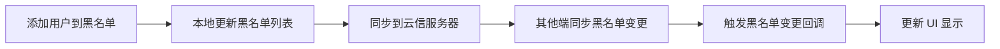

网易云信即时通讯 SDK（NetEase IM SDK，简称 NIM SDK）提供用户黑名单的管理。

本文详细介绍了 NIM SDK 的用户黑名单管理功能。您将了解如何添加、移除黑名单用户，以及如何获取黑名单列表。本文还包含了各平台的代码示例，帮助开发者快速集成和使用黑名单功能。

## 技术原理

NIM SDK 支持用户的黑名单列表管理。若需要屏蔽指定用户的消息，可以该用户拉入黑名单列表。

NIM SDK 通过维护一个用户级别的黑名单列表来实现黑名单功能。当一个用户被加入黑名单后，SDK 会在本地和服务器端同步这一信息。黑名单的实现主要涉及以下几个方面：

| 功能 | 描述 |
| --- | --- |
| 消息过滤 | 当收到消息时，SDK 会检查发送者是否在接收者的黑名单中。如果在，则会拦截该消息，不会传递给应用层。
| 发送限制 | 当用户尝试向将自己加入黑名单的用户发送消息时，SDK 会返回发送失败的错误。
| 实时更新 | 当黑名单发生变化时（如添加或移除用户），SDK 会触发相应的回调，使应用能够及时更新 UI。

黑名单操作的基本流程：



<!--
## 效果展示

-->

## 前提条件

在使用黑名单功能之前，请确保您已完成以下步骤:

- 已实现 [登录 IM](https://doc.yunxin.163.com/messaging2/guide/Dk1MTY4MzA?platform=client)。
- 了解 NIM SDK 中黑名单功能的原理。

## 注意事项

- 每个账号可设置黑名单的上限为 3000。
- 当用户 A 将用户 B 拉黑：
    - 用户 A 将不会再接收到用户 B 发送的任何消息。
    - 用户 B 发送消息给用户 A 时，消息会发送失败，并提示已被对方拉黑。
    - 用户 A 仍能发送消息给用户 B，B 可以正常接收。

- 当用户 A 将 用户 B 拉黑后，用户 B 默认仍能对用户 A 发起呼叫（信令功能）。若需要使被拉黑者无法唤起呼叫，可以在 [网易云信控制台](https://app.yunxin.163.com/global/home) 为应用开通 **被拉黑时被拉黑者无法唤起呼叫** 开关。

- 当用户 A 将 用户 B 拉黑后，用户 A 仍能发送消息给用户 B，但是不会接收到用户 B 的消息（包括已读回执），因此在该场景下，用户 A 无法知晓发送给用户 B 的消息，用户 B 是否已读。若用户 A 需要知晓用户 B 是否已读，即需要接收用户 B 发送的消息已读回执，可以在 [网易云信控制台](https://app.yunxin.163.com/global/home) 为应用开通 **拉黑场景可以正常下发消息已读回执通知** 开关。


## 监听黑名单相关事件

在进行黑名单相关操作前，您可以提前注册相关事件。注册成功后，当黑名单相关事件发生时，SDK 会触发对应回调通知。

### 注册监听

黑名单相关回调：

- **`onBlockListAdded`**：黑名单新增用户回调，返回新加入黑名单的用户列表。当客户端本端添加用户到黑名单，或者其他端同步添加用户到黑名单时触发该回调。
- **`onBlockListRemoved`**：黑名单移除用户回调，返回移出黑名单的用户列表。当客户端本端从黑名单移除用户，或者其他端同步从黑名单移除用户时触发该回调。

**示例代码**：

:::::: div linked-codes
::: code Node.js/Electron
调用 [`on("EventName")`](https://doc.yunxin.163.com/messaging2/client-apis/jc0MTUyODY?platform=client#on) 方法注册监听：

```TypeScript
v2.userService.on("blockListAdded", function (user: V2NIMUser) {
    // 处理新增黑名单用户的逻辑
    console.log("User added to blacklist:", user.accountId);
})
v2.userService.on("blockListRemoved", function (accountId: string) {
    // 处理移除黑名单用户的逻辑
    console.log("User removed from blacklist:", accountId);
})
```
:::
::::::

### 移除监听

:::::: div linked-codes
::: code Node.js/Electron
如需移除黑名单相关监听器，可调用 [`off("EventName")`](https://doc.yunxin.163.com/messaging2/client-apis/jc0MTUyODY?platform=client#off) 方法。

```TypeScript
v2.userService.off("blockListAdded", function (user: V2NIMUser) {})
v2.userService.off("blockListRemoved", function (accountId: string) {})
```
:::
::::::

## 添加指定用户进黑名单

调用 `addUserToBlockList` 方法将指定用户添加进黑名单，即拉黑指定用户。添加成功后，SDK 会返回黑名单用户新增回调 `onBlockListAdded`。

如果指定用户被加入了黑名单，那么就不再会收到此用户发送的任何消息。但是对于指定用户而言，不受影响。例如：A 用户将 B 用户加入黑名单，B 用户发送的消息，A 用户将接收不到。但是 A 用户发送的消息，B 用户依然可以接收到。

**示例代码**：

:::::: div linked-codes
::: code Node.js/Electron
```TypeScript
try {
    await v2.userService.addUserToBlockList(accountId);
    console.log("User successfully added to blacklist");
    // 添加成功,可以在这里更新UI或执行其他操作
} catch (error) {
    console.error("Failed to add user to blacklist:", error);
    // 添加失败,处理错误
}
```
:::
::::::

## 将指定用户移出黑名单

调用 `removeUserFromBlockList` 方法将指定用户移出黑名单。移除成功后，SDK 会返回黑名单用户移除回调 `onBlockListRemoved`。

如果一个用户被从黑名单移除，那么会重新收到此用户发送的消息。移出黑名单操作不会影响之前被拦截的消息，那些消息仍然不会被接收。

**示例代码**：

:::::: div linked-codes
::: code Node.js/Electron
```TypeScript
try {
    await v2.userService.removeUserFromBlockList(accountId);
    console.log("User successfully removed from blacklist");
    // 移除成功,可以在这里更新UI或执行其他操作
} catch (error) {
    console.error("Failed to remove user from blacklist:", error);
    // 移除失败,处理错误
}
```
:::
::::::

## 获取黑名单用户

调用 `getBlockList` 方法获取黑名单用户列表，查看已拉黑的用户。

获取黑名单列表可能需要一定时间，特别是在黑名单用户较多的情况下。建议在应用启动时获取一次黑名单列表，并在本地缓存，后续可通过监听黑名单变更事件来更新缓存。

**示例代码**：

:::::: div linked-codes
::: code Node.js/Electron
```TypeScript
try {
    const blockList = await v2.userService.getBlockList();
    console.log("Block list retrieved:", blockList);
    // 获取成功,处理黑名单列表
} catch (error) {
    console.error("Failed to get block list:", error);
    // 获取失败,处理错误
}
```
:::
::::::

## 查看是否在黑名单

查看指定用户是否在黑名单中。

返回 true 的账号表示在黑名单中，若不在黑名单，或者账号不存在则统一返回 false。

**示例代码**

:::::: div linked-codes
::: code Node.js/Electron
```TypeScript
const result = await v2.userService.checkBlock(['accountId1', 'accountId2'])
// handle result
```
:::
::::::

## 相关接口

通过使用以下 API，开发者可以为用户提供有效的消息过滤和用户屏蔽功能，提升应用的用户体验。在实际开发中，请结合具体需求和场景，合理使用黑名单功能。

:::::: div linked-codes
::: code Web/uni-app/小程序/Node.js/Electron/鸿蒙
API | 说明
--- | ---
[`on("EventName")`](https://doc.yunxin.163.com/messaging2/client-apis/jc0MTUyODY?platform=client#on) | 注册用户资料相关监听器
[`off("EventName")`](https://doc.yunxin.163.com/messaging2/client-apis/jc0MTUyODY?platform=client#off) | 取消注册用户资料相关监听器
[`addUserToBlockList`](https://doc.yunxin.163.com/messaging2/client-apis/jc0MTUyODY?platform=client#addUserToBlockList) | 添加指定用户进黑名单
[`removeUserFromBlockList`](https://doc.yunxin.163.com/messaging2/client-apis/jc0MTUyODY?platform=client#removeUserFromBlockList) | 将指定用户移出黑名单
[`getBlockList`](https://doc.yunxin.163.com/messaging2/client-apis/jc0MTUyODY?platform=client#getBlockList) | 获取黑名单用户列表
[`checkBlock`](https://doc.yunxin.163.com/messaging2/client-apis/jc0MTUyODY?platform=client#checkBlock) | 查看指定用户是否在黑名单中 
:::
::::::

## 常见问题

Q: 将用户加入黑名单后，之前的聊天记录会怎样？ 

A: 加入黑名单不会删除之前的聊天记录，但会阻止接收该用户的新消息。

Q: 黑名单是双向的吗？ 

A: 不是。如果用户 A 将用户 B 加入黑名单，只会阻止 A 接收 B 的消息，不会影响 B 接收 A 的消息。

Q: 黑名单有数量限制吗？ 

A: 是的，每个账号最多可以将 3000 个用户加入黑名单。

Q: 如何处理黑名单同步问题？ 

A: SDK 会自动同步黑名单信息到所有登录设备。您只需要监听黑名单变更事件并更新 UI 即可。

Q: 被加入黑名单的用户会收到通知吗？ 

A: 不会。被加入黑名单的用户不会收到任何通知，只会在尝试发送消息时收到发送失败的提示。