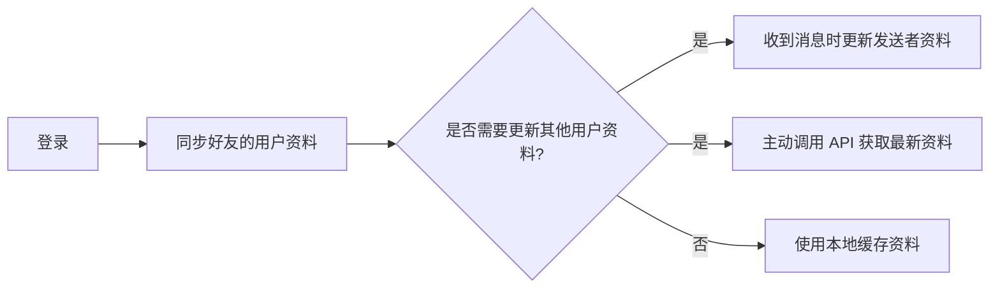

网易云信即时通讯 SDK（NetEase IM SDK，简称 NIM SDK）提供用户信息的托管，实现用户资料的统一管理和共享。

本文介绍了如何使用 NIM SDK 管理用户资料。您将了解如何更新、获取和搜索用户信息，以及如何监听用户资料变更事件。

## 技术原理

NIM SDK 提供了完整的用户资料管理功能，包括：

- 更新自身用户资料
- 获取指定用户资料
- 根据关键信息搜索用户资料
- 监听用户资料变更事件

用户资料包括用户昵称、性别、头像、签名、手机、邮箱、生日等信息。SDK 会将用户资料缓存到本地，但是除自身的资料外，SDK 不保证其他用户资料的实时更新。以下事件会触发其他用户资料的更新：

- 登录时会同步好友的用户资料（注册数据同步 `addLoginDetailListener.onDataSync` 回调，完成会发出通知）。
- 收到其他用户发来消息时，如果消息发送者的用户资料有更新，则 SDK 会同步更新对方的用户资料。
- 直接调用 SDK 接口从服务器拉取最新的用户资料，具体请参考本文的 [云端获取用户信息](#云端获取用户信息)。

::: note note
- 如果既不是好友，也未收到该用户发送的消息，则 SDK 不会实时更新对方的用户资料。
- 如果需要同步的用户资料较多，SDK 的同步时间可能会较长。
:::



<!--
## 效果展示

-->

## 前提条件

在使用用户资料管理功能之前，请确保您已完成以下步骤:

- 已实现 [登录 IM](https://doc.yunxin.163.com/messaging2/guide/Dk1MTY4MzA?platform=client)。
- 了解 NIM SDK 中用户资料管理功能的原理。

## 监听用户相关事件

在进行用户相关操作前，您可以提前注册相关事件。注册成功后，当用户相关事件发生时，SDK 会触发对应回调通知。

### 注册监听

用户相关回调：

**`onUserProfileChanged`**：用户资料变更回调，返回变更的用户资料列表。

**示例代码**：

:::::: div linked-codes
::: code Web/uni-app/小程序
调用 [`on("EventName")`](https://doc.yunxin.163.com/messaging2/client-apis/jc0MTUyODY?platform=client#on) 方法注册监听：

```TypeScript
nim.V2NIMUserService.on("onUserProfileChanged", function (users: V2NIMUser[]) {})
```
:::
::::::

### 移除监听

:::::: div linked-codes
::: code Web/uni-app/小程序
如需移除用户相关监听器，可调用 [`off("EventName")`](https://doc.yunxin.163.com/messaging2/client-apis/jc0MTUyODY?platform=client#off) 方法。

```TypeScript
nim.V2NIMUserService.off("onUserProfileChanged", function (users: V2NIMUser[]) {})
```
:::
::::::

## 更新本人用户资料

调用 `updateSelfUserProfile` 方法更新自身的用户资料。

可可更新的字段包括：

- `name`：用户昵称
- `avatar`：头像 URL
- `gender`：性别
- `birthday`：生日
- `mobile`：手机号
- `email`：邮箱
- `sign`：个性签名
- `serverExtension`：服务器扩展字段

更新用户资料成功后，SDK 会返回用户资料变更回调 `onUserProfileChanged`，并同步缓存到本地。

**示例代码**：

:::::: div linked-codes
::: code Web/uni-app/小程序
```TypeScript
nim.V2NIMUserService.updateSelfUserProfile({
    name: 'ab',
});
```
:::
::::::

## 获取用户资料

调用 `getUserList` 方法根据用户账号 ID 批量查询指定的用户资料列表。

该方法根据用户账号 ID 先从客户端本地获取用户资料数据，若本地数据缺失或不足，再查询服务端中的用户资料数据。

::: note note
- 单次最多查询 150 个用户资料。
- 若传入的账号 ID 都不存在，则调用接口失败。若部分账号 ID 存在，则调用接口成功。调用结果只返回账号 ID 存在的用户资料，错误的账号 ID 不返回。
:::

**示例代码**：

:::::: div linked-codes
::: code Web/uni-app/小程序
```TypeScript
const userProfiles = await nim.V2NIMUserService.getUserList(['accid1', 'accid2'])
```
:::
::::::

## 根据关键字搜索用户信息

调用 `searchUserByOption` 方法根据关键字信息搜索用户的资料信息。

该方法默认搜索用户的昵称，若有需要，也可以指定同时搜索用户账号和手机号。

**示例代码**：

:::::: div linked-codes
::: code Web/uni-app/小程序
```TypeScript
try {
    const users = await nim.V2NIMUserService.searchUserByOption({
        keyword: 'nick',
        searchName: true,
        searchAccountId: false,
        searchMobile: true
    })
} catch(err) {
    console.error('searchUserByOption Error:', err)
}
```
:::
::::::

## 云端获取用户信息

调用 `getUserListFromCloud` 方法根据用户账号列表从服务器获取最新的用户信息。

::: note note
- 查询用户信息一般建议使用 `getUserList` 接口，只有需要强制拉取最新用户信息才需要调用 `getUserListFromCloud` 接口。
- 避免频繁调用云端接口，合理使用本地缓存。
:::

**示例代码**：

:::::: div linked-codes
::: code Web/uni-app/小程序
```TypeScript
const users = await nim.V2NIMUserService.getUserListFromCloud(["AccountID1", "AccountID2"])
```
:::
::::::

## 相关接口

通过使用以下 API，开发者可以为用户提供有效的用户资料管理功能，提升应用的用户体验。在实际开发中，请结合具体需求和场景，合理使用用户资料管理功能。

:::::: div custom-tabs
::: tab 安卓/iOS/macOS/Windows
API | 说明
--- | ---
[`addUserListener`](https://doc.yunxin.163.com/messaging2/client-apis/jc0MTUyODY?platform=client#addUserListener) | 注册用户资料相关监听器
[`removeUserListener`](https://doc.yunxin.163.com/messaging2/client-apis/jc0MTUyODY?platform=client#removeUserListener) | 取消注册用户资料相关监听器
[`updateSelfUserProfile`](https://doc.yunxin.163.com/messaging2/client-apis/jc0MTUyODY?platform=client#updateSelfUserProfile) | 更新自己的用户资料
[`getUserList`](https://doc.yunxin.163.com/messaging2/client-apis/jc0MTUyODY?platform=client#getUserList) | 根据用户账号 ID 列表获取用户资料
[`searchUserByOption`](https://doc.yunxin.163.com/messaging2/client-apis/jc0MTUyODY?platform=client#searchUserByOption) | 根据关键字信息搜索用户信息
[`getUserListFromCloud`](https://doc.yunxin.163.com/messaging2/client-apis/jc0MTUyODY?platform=client#getUserListFromCloud) | 根据用户账号列表从服务器获取用户信息
:::
::: tab Web/uni-app/小程序/Node.js/Electron/鸿蒙
API | 说明
--- | ---
[`on("EventName")`](https://doc.yunxin.163.com/messaging2/client-apis/jc0MTUyODY?platform=client#on) | 注册用户资料相关监听器
[`off("EventName")`](https://doc.yunxin.163.com/messaging2/client-apis/jc0MTUyODY?platform=client#off) | 取消注册用户资料相关监听器
[`updateSelfUserProfile`](https://doc.yunxin.163.com/messaging2/client-apis/jc0MTUyODY?platform=client#updateSelfUserProfile) | 更新自己的用户资料
[`getUserList`](https://doc.yunxin.163.com/messaging2/client-apis/jc0MTUyODY?platform=client#getUserList) | 根据用户账号 ID 列表获取用户资料
[`searchUserByOption`](https://doc.yunxin.163.com/messaging2/client-apis/jc0MTUyODY?platform=client#searchUserByOption) | 根据关键字信息搜索用户信息
[`getUserListFromCloud`](https://doc.yunxin.163.com/messaging2/client-apis/jc0MTUyODY?platform=client#getUserListFromCloud) | 根据用户账号列表从服务器获取用户信息
:::
::: tab Flutter
API | 说明
--- | ---
[`listen`](https://doc.yunxin.163.com/messaging2/client-apis/jE0MTIzODg?platform=client#listen) | 注册用户资料相关监听器
[`cancel`](https://doc.yunxin.163.com/messaging2/client-apis/jE0MTIzODg?platform=client#cancel) | 取消注册用户资料相关监听器
[`updateSelfUserProfile`](https://doc.yunxin.163.com/messaging2/client-apis/jE0MTIzODg?platform=client#updateSelfUserProfile) | 更新自己的用户资料
[`getUserList`](https://doc.yunxin.163.com/messaging2/client-apis/jE0MTIzODg?platform=client#getUserList) | 根据用户账号 ID 列表获取用户资料
[`searchUserByOption`](https://doc.yunxin.163.com/messaging2/client-apis/jE0MTIzODg?platform=client#searchUserByOption) | 根据关键字信息搜索用户信息
[`getUserListFromCloud`](https://doc.yunxin.163.com/messaging2/client-apis/jE0MTIzODg?platform=client#getUserListFromCloud) | 根据用户账号列表从服务器获取用户信息
:::
::::::

## 常见问题

Q: 为什么有时获取不到其他用户的最新资料？ 

A: SDK 不保证实时更新其他用户的资料。如需最新资料，请使用 `getUserListFromCloud` 方法。

Q: 更新自己的资料后，其他用户何时能看到？

A: 其他用户需要主动刷新或收到您发送的消息才会更新您的资料。

Q: 搜索用户时，如何提高搜索效率？

A: 可以通过设置 `V2NIMUserSearchOption` 的参数来缩小搜索范围，如只搜索昵称或只搜索账号。

Q: 如何处理用户资料变更的通知？

A: 注册 `onUserProfileChanged` 监听器，在回调中更新 UI 或本地存储的用户信息。

Q: 单次最多可以获取多少个用户的资料？ 

A: 单次最多可以获取 150 个用户的资料。如需获取更多，请分批次调用。